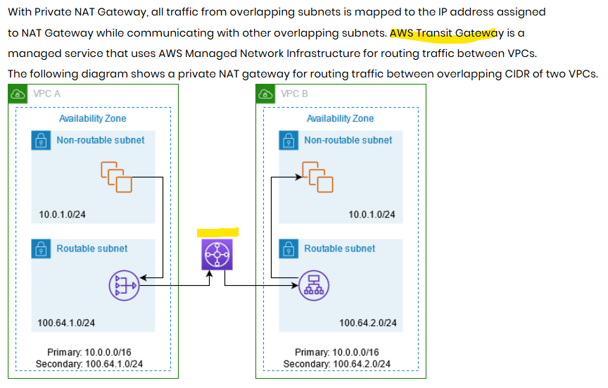
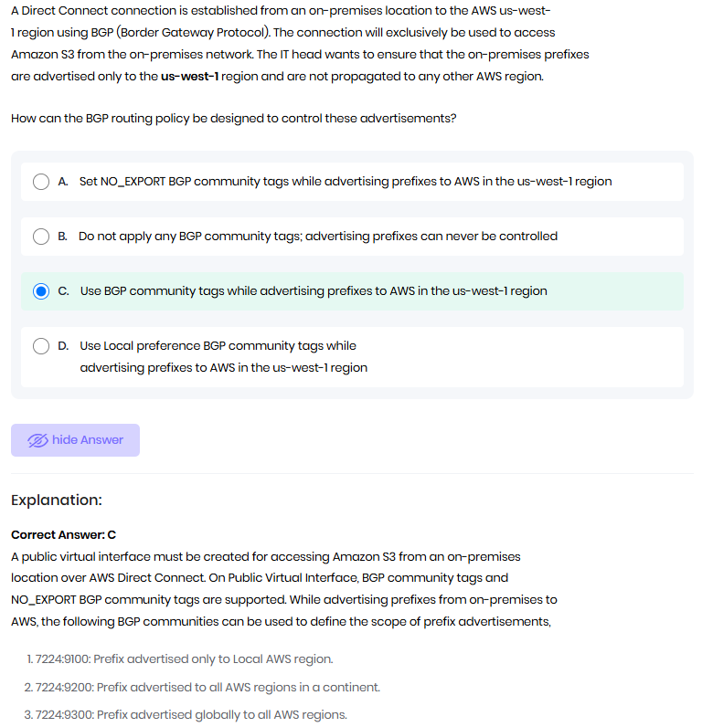

## 1
You have multiple AWS accounts within a single AWS Region managed 
by AWS Organizations and you would like to ensure all Amazon EC2 
instances in all these accounts can communicate privately. 
Which of the following solutions provides the capability at the `CHEAPEST` cost 

- VPC peering
  - only pay for the data transfer. **CHEAPEST** :point_left:
- AWS Transit Gateway
  - pay for the data transfer
  - incur costs for each attachment (VPC, VPN, etc.)
- AWS PrivateLink
  - high costs associated with endpoint services and data processing
- VPN Connections
  - VPN gateway attach to each VPC.
  - Site2Site connection
  - VPN gateway charges and data transfer costs

```text
Cost Comparison:

VPC Peering → Only pay for data transfer (cheapest option). ✅
AWS Transit Gateway → Data transfer + per VPC attachment fees (costly). ❌
AWS PrivateLink → High costs for endpoint services & processing (most expensive). ❌
VPN Connections → VPN gateway charges + data transfer (not cost-effective for intra-region). ❌

🔹 VPC Peering is the cheapest because it only charges for data transfer without extra attachment fees. 🚀
```

---
## 2  Communication Between Two VPCs with Overlapping CIDR
```text
How to Enable Communication Between Two VPCs with Overlapping CIDR?
Since VPC Peering and Transit Gateway do NOT support overlapping CIDRs, you must use NAT or VPN-based solutions.

✅ Solution 1: NAT Gateway (Most Common)
VPC-1 (CIDR: 10.0.0.0/16) → Use Private NAT Gateway.
VPC-2 (CIDR: 10.0.0.0/16) → Use another Private NAT Gateway.
Assign non-overlapping Elastic IPs or secondary CIDRs for NAT translation.
Route traffic via NAT Gateway instead of direct peering.

✅ Solution 2: AWS Transit Gateway with NAT
Use Transit Gateway (TGW) with NAT for IP translation between VPCs.
Requires custom route tables to avoid conflicts.

```


---
## 3 Dx and BGP (Border gateway protocol)


---
## 4 VPC connectivity with vpce
- region-1 :VPC-1/2/....
- connect VPCs - already know VPC peering and transient gateway
- another way: vpce
- eg: vpce for NLB
- 

---
## 5