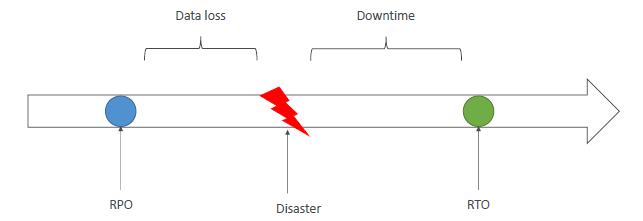
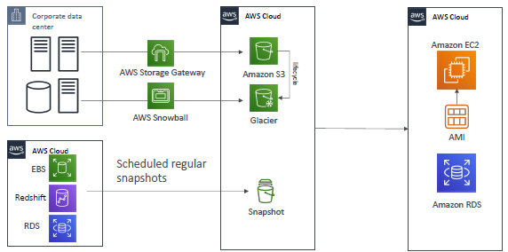
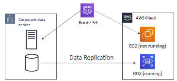
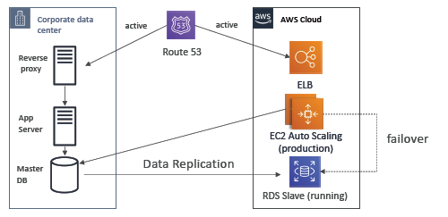
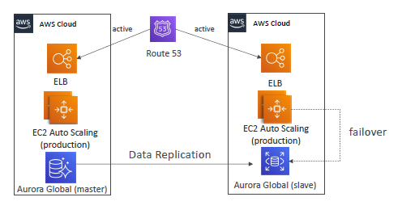

# DR
- https://www.youtube.com/watch?v=OmASCUJEVy8 bm
--- 
## ✔️Terminologies
### 💠Disaster
- event that has a negative impact on a company’s business continuity or finances

### 💠DR (Disaster Recovery)
- preparing for and recovering from a disaster.
- AWS makes DR easier and more cost-effective compared to traditional on-premises setups
- **type**:
  - On-premise <=> On-premise
  - On-premise <=> AWS Cloud `hybrid recovery`
  - AWS Cloud Region <=> AWS Cloud Region B ✔️
---



### 💠RPO: Recovery `Point` Objective
>RPO is the maximum acceptable data loss
- taking backup/replication in every one hr, 
- so if D happens, then can take restore from backup/point taken an hr ago.
- so rpo is 1hr here.
- 1 min is expensive than 1 hr
- **low** RPO === **expensive**
  
### 💠RTO: Recovery `Time` Objective
> RTO is the maximum acceptable downtime
- D happened, it took 2 hour to recover.
- there was downtime of 2 hr
- 15 min is expensive than 2 hr.
- **low** RTO === **expensive**

### 💠failover
Failover is the automatic switch to a backup system when the primary system fails

### 💠fallback
Fallback is the process of switching back to the primary system once it's restored and operational

---
## ✔️DR Strategies

### 1. backup / restore
> - Simplest and most cost-effective,
> - but has the **longest RTO**. === downtime.
> - Not Suitable for non-critical systems

app-code/system
- backup AMI, restore it
- docker images, helm chart, ecs-task-def

IAC
- run to create system infra
- terraform
- aws cloud formation

CI/CD pipeline to deploy
- aws code pipeline
- harness / circle Ci / jenkins

Database / storage
- RDS --> backup/replication in every 1 hr --> s3 backup/snapshot to another az or region
- restore from db from s3 snapshot
- more
  - use cross region replication for rds
  - or use Aurora --> have read Replica/s in other region 
  - or use global aurora -->  have read Replica/s in other region ( < 1 sec)
  - and promote aurora read replica as primary in DR.



### 2. Pilot light
- A **minimal/small version** of the app (critical business workload) is always running in different region.
-  allowing for quicker scaling to full application
- update r53 to switch, on DR.
- continuously replicate critical db to this region.



### 3.  warm light ✔️
- **Full but scaled-down version** of your system, up and running in different region
- Upon disaster, just `scale up` to `production load`

### 4. Hot standby / multi site 
- `active - active`
- **mission-critical system**
- Full Production Scale is running on AWS or On Premise
- on DR event, it will inactive - active.
- no recovery need to do.
- RTO is in second/min
- expensive





---
## ✔️DR tips
- **Backup**
  - EBS Snapshots, RDS automated `backups` / Snapshots, etc…
  - Regular pushes to S3 / S3 IA / `Glacier`, Lifecycle Policy, `Cross Region Replication`
  - From On-Premise: `Snowball` or `Storage Gateway`
  
- **High Availability**
  - Use `Route53` to migrate DNS over from Region to Region
  - RDS `Multi-AZ`, ElastiCache Multi-AZ, EFS, S3
  - `Site to Site VPN` as a recovery from `Direct Connect`
  - Use `ASG`, ALB

- **Automation**
  - `CloudFormation` / Elastic Beanstalk to re-create a whole new environment
  - `Reboot EC2 instances` with CloudWatch if alarms fail
  - AWS `Lambda`  to automation to build infra, etc
  - `IAC` / terraform

- **on-prem tips**
  - `aws`:ec2-i1 <==> **import/export** <==> `on-pre`m:vm-1 
  ```
  - aws Amazon AMI 
    - download .iso file
    - then run AMI on on-prem, 
      - with hyper-v, virtual-box, etc.
  ```
---