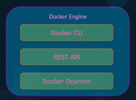
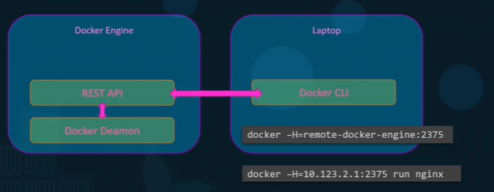
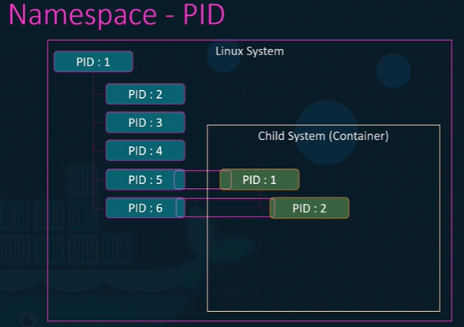
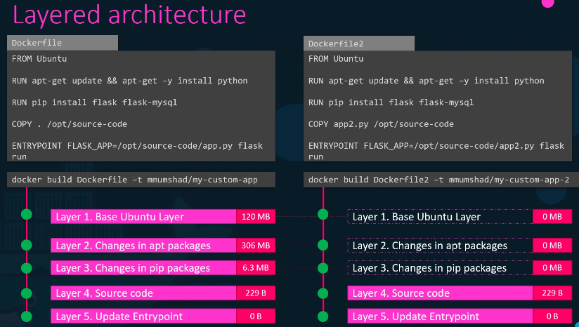
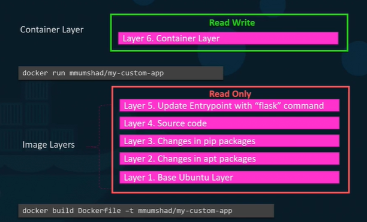
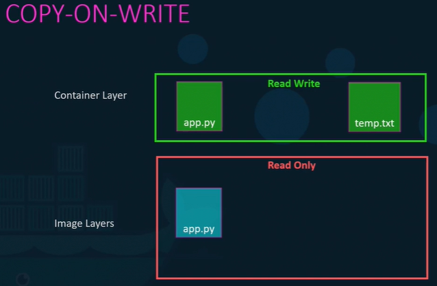
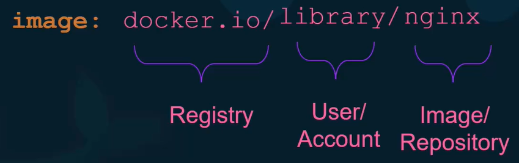
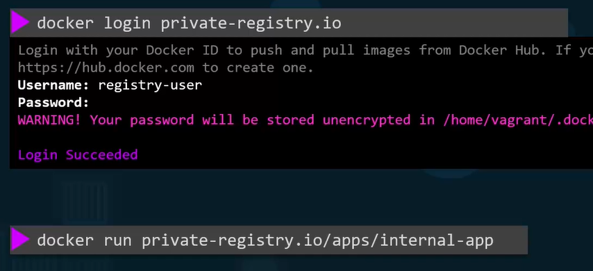
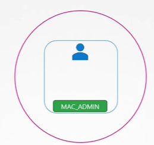
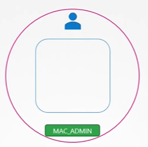

- [Started from here kodekloud](https://learn.kodekloud.com/user/courses/docker-training-course-for-the-absolute-beginner)

```
- cluster > namespace > 
  - pod-1
    - c1
      - process-1: port-1
      - process-2 : port-2
      - ...
    - c2
        - process-11 : port-11
        - process-22 : port-22
        - ...
```

```
Docker Client (CLI)  
       ↓ (REST API)  
  Docker Daemon (dockerd) → Manages → Images → Containers  
       ↑  
Registry (Docker Hub, ECR, etc.)  
```

```
/var/lib/docker/ --> check this location
- /containers 🔸
- /images 🔸
    Stores all layers
- /volumes  🔸
  - Docker-managed volumes 
  - Volumes can be shared between containers
  - allow to manage data seperately from host
  - /var/lib/docker/vol-1 -- better
  - /path/to/host/dir  - host + container, both using them
```

---

## Docker's runtime
- container-d
- core runtime that powers Docker.
- It is a lightweight, modular application consisting of:
  - **Docker Daemon** (`docker-d`) :point_left:
    - A background service
    - manages Docker objects (containers, images, networks, volumes).
    - Handles container lifecycle
    - Pulls/pushes images from/to registries.
    - create layers
  - **REST API** – Allows interaction with the daemon programmatically (e.g., via CLI or SDKs).
  - **CLI** (optional)






## Docker Images
- read-only template used to create containers
- each instruction in a Dockerfile creates a new layer
- Application code + dependencies (libraries, runtime)
- Metadata (environment variables, default commands)

## Container
- **runnable** instance of an image
- **Isolated process** running on the host OS via namespace. basically container cannot see anything out of its **namespace**.
- Shares the **host kernel** + thus not completed isolated
- but has its own **filesystem** ⬅️
- `ps aux` show all process
  - a - all user
  - u - user-oriented format
  - x - includes daemon process
  - same process has diff pid in diff namespace. ⬅️
  



## Docker host (agent)
- on host machine install docker
- eg: docker desktop on out laptops.
- all containers runs on this docker host.


---
## Layered Architecture







---
## Docker Image Registry





---
## Container Security
- by default, docker runs container with `root` user ( UID 0 , with less Linux **capability**)
- dockerfile > USER < userID >
- docker run --user option
- (container root ≠ host root)
- Docker applies namespaces and capability restrictions to limit what this root user can do
- `--cap-add`
- `--cap-drop`

| Capability       | Purpose                                    |
| ---------------- | ------------------------------------------ |
| `CAP_SYS_ADMIN`  | Superpower, including mounting filesystems |
| `CAP_NET_ADMIN`  | Change network settings                    |

- can add at container level (precedence) +  pod level

  

## v2
## A. Containers
- `isolated environment` : physical machine > VM > Containers(host OS)
- Containers are similar to VMs, but share the Operating System (OS) among the applications.
- Therefore, containers are considered lightweight.
- Similar to a VM, a container has its own filesystem, share of CPU, memory, process space, and more.
- As they are decoupled from the underlying infrastructure, they are portable across clouds and OS distributions.


### Container images
- eg: Docker image
- image built on OS-1 as base, can be run my machine having window OS. docker desktop in between.
- best suited for microservices/MS by providing `portability` and `isolated VM`
- `executable package`, which confine the  `code,runtime and dependencies, env var+configFile` in a pre-defined format.
- Composed of `multiple layers`, stacked on top of a base image.
- Images are stored in `repositories`, which can be public or private. eg : Docker Hub, ECR
- `versioned` using tags
- Security:
  - Use `trusted base-images`
  - identify `vulnerabilities` in images and upgrade it. docker has built in scanner.
  - regularly update images to include security patches.


