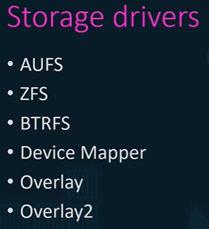
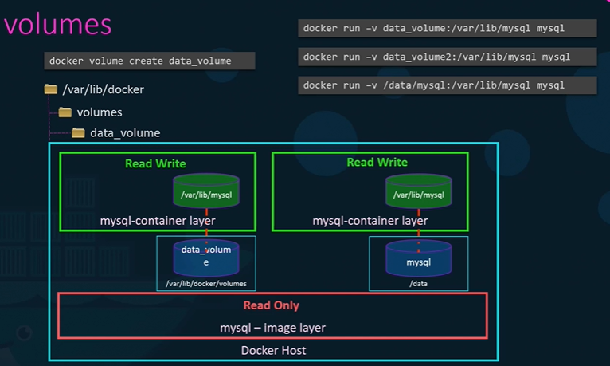

## A.Storage
### storage drivers
- based on OS picks auto picks correct one.



### 1. Docker-managed volumes
- allow to manage data **separately** from host
- **docker volume create vol-1:location-on-host**
- --mount type=volume, source=vol-1, target=/container/path
```
/var/lib/docker/ --> check this location
- /containers 🔸
- /images 🔸
- /volumes  🔸
      /vol-1
```


### 2. share volume with host
- --mount type=bind,   source=/path/to/host/dir , target=/container/path
- /path/to/host/dir  - host + container, both using them


