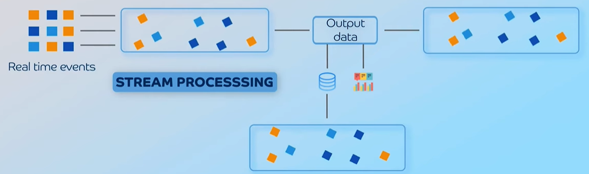
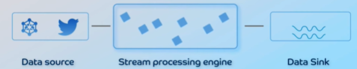
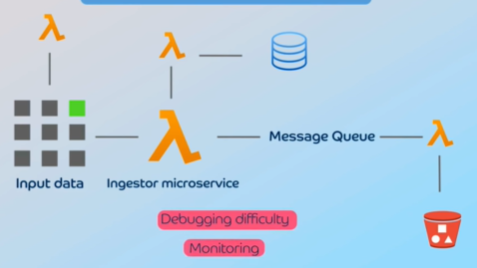
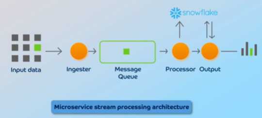

# Stream processing Architecture
## Overview
- https://www.youtube.com/watch?v=mG3xQb_-rV4
- analyzes and processes data in real-time as it's generated
- 3 phases : 
  - **ingest**
  - **process**
  - **output**
- eg: Fraud Detection

---
## Components

**1 Data Source** 
- e.g., IoT devices, website clickstreams

> messaging layer in between 1 and 2 + DLQ

**2 Stream Processing Engine** 
- configure data ingestor
  - while  ingesting can do some processing
  - use AWS lambda
- real-time data transformation
- configure DataSink
- check managed service [03_01_KDS_KinesisDataStream.md](../CE_02_AWS_SAA/05_decoupling/03_01_KDS_KinesisDataStream.md)

> messaging layer between 2 and 3 + DLQ

**3 Data sink**
- for storing or further processing the data 
- e.g., data warehouse, data lake, s3, databases
- check managed service [03_02_KDF_KinesisDataFirehose.md](../CE_02_AWS_SAA/05_decoupling/03_02_KDF_KinesisDataFirehose.md)

---
## **Role of Message Brokers**

- Message brokers, **decouples** data producers from consumers. 
  - enable asynchronous communication
  - improve system performance 
  - reliable and scalable 
- make system to handling **large message volumes**  👈🏻
- **recovering from failures using DLQ** 👈🏻
- **helps to reply** 👈🏻
- **analytics**:
  - use stored msg for analytics and understand trends
  - save only failed message to save cost $$
---

## Role of microServices 
- Rather than using aws or managed service, can crete **custom stream processor** with microservice architecture
- Microservices are **beneficial** for complex applications because:
  - they are small and  focused
  - loosely coupled 
  - stateless, scalable, reliable 
  - easy to debug and monitor in a streaming environment.

**Example: implementing an ingested microservice using AWS Lambda**

**Recommended approach** 
- Assign one microservice to each stage of stream processing: 
  - ingester (ms1, or with lambda, KDS, fargate, etc) 
  - processor (ms2)
  - output (ms3)

