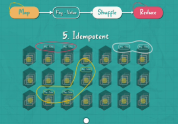
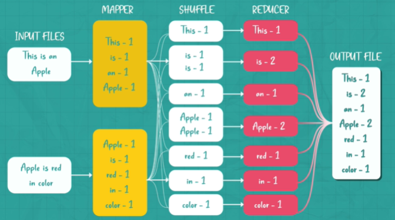

# Maps-reduce Framework
> Hadoop 
## Overview
- Google challenge 2012:
  - faced the challenge of processing huge volumes of data collected 24/7
  - **MapReduce** helps to **process massive distributed datasets** efficiently 
  - and in a **fault-tolerant manner**
  - https://static.googleusercontent.com/media/research.google.com/en//archive/mapreduce-osdi04.pdf
- it's a  **programming model** that works in two main **phases**: 
  - ✔️Map phase
    - involve **splitting and mapping data**, 
    - transforming it into **key-value pairs** 
    - These pairs are stored in an intermediary step
  - ✔️Reduce phase
    - **shuffle and reorganize** these key-value pairs
    - finally reducing them into a final output

> Simplification for Engineers
> 
> The MapReduce framework simplifies large data processing by:
> - allowing engineers to focus on the inputs and expected outputs of the map and reduce functions
> - typically use library implementations like **Hadoop**
> - only need to understand the inputs and outputs of these functions
---
## key concepts

Distributed File System: 
- Assumes data is split into chunks, 
- replicated, and spread across many machines

Central Controller: 
- A central component in the distributed file system 
- that knows where data chunks reside 
- and communicates with all machines

Map 
- Map functions operate on data **locally**, 
- meaning map programs are sent to each node.
- instead of moving large datasets
- result into  intermediary key-value structure

Reduce
- Key-Value Structure are crucial for the reduce phase 
- allowing for commonalities and patterns to be identified and reduced

Fault Tolerance  👈🏻
- The model handles machine failures or network partitions 
- by **re-performing** map or reduce operations **by the Central Controller**
- This is possible if the functions are **idempotent**
- meaning repeating them multiple times does not change the outcome

---
## key concepts : Word Count

---
## Use case
YT likes
- An example use case is finding videos with a certain number of likes 
- from millions of YouTube videos and their metadata
- hint: **collectively analyze**

