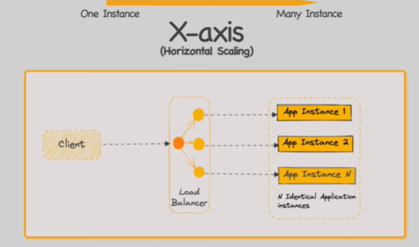
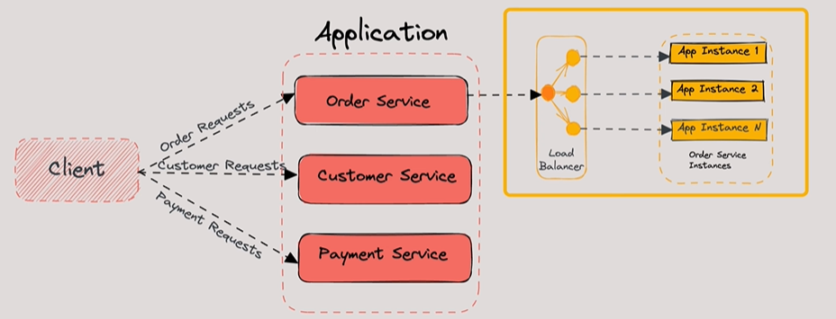

# Scaling
## Overview

## Scale Cube 🧊
https://www.youtube.com/watch?v=q1RUnL4xTds
### X-axis / `Monolith`
- scale monolith app
- running **multiple identical instances** of an application behind a load balancer
- It's a **horizontal scaling approach** that adds computing resources to handle increased loads.

### Y-axis / ??
- running **multiple identical instances** of an application behind a (load balancer + **Router**)
- **Router** routes requests based on attributes

### Z-axis / `Microservices`
- Also known as **functional decomposition**, 
- this involves breaking an application into smaller, independent services (microservices).
- Each service is responsible for a particular function (e.g., order management) 
- and can be scaled independently using X-axis

> 👉Popular:  faster development, easier maintenance, and better scalability

