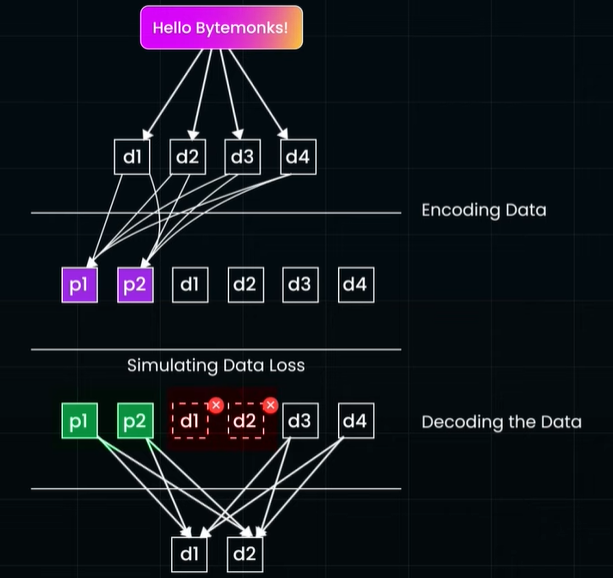

# Erasure Coding
## Overview

- https://www.youtube.com/watch?v=VUxXH4uo4AY bm
- Cloud storage giants like AWS S3, Azure Blob Storage, and Google Cloud Storage utilize **erasure coding** to manage massive amounts of data cost-effectively and ensure durability.
- significantly reduces storage overhead compared to full replication
- `reed_solomon` py lib

- **How it Works**
    - The system splits a file into 'K' **data chunks**
    - and generates 'M' **parity chunks**.
    - These parity chunks store
        - mathematical patterns,
        - not copies,
        - allowing reconstruction of missing data 