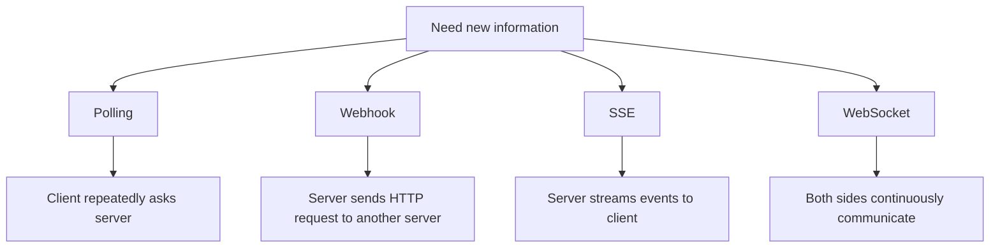
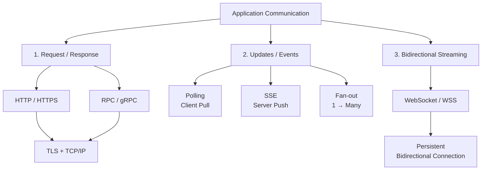
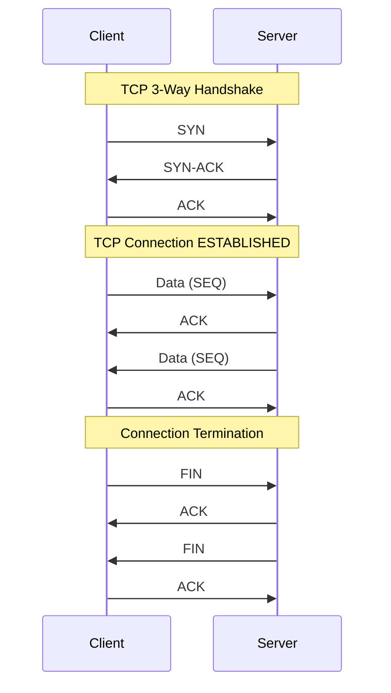
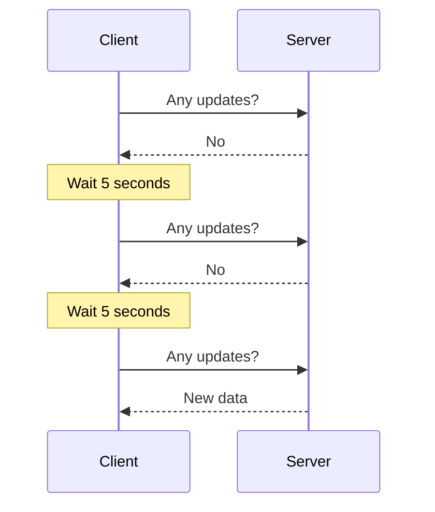
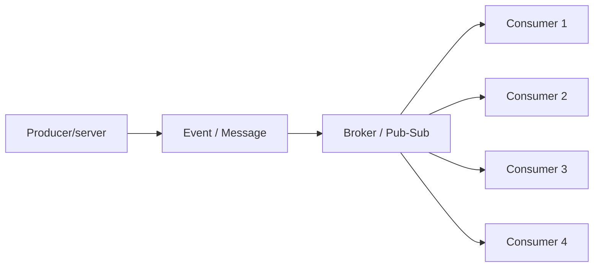
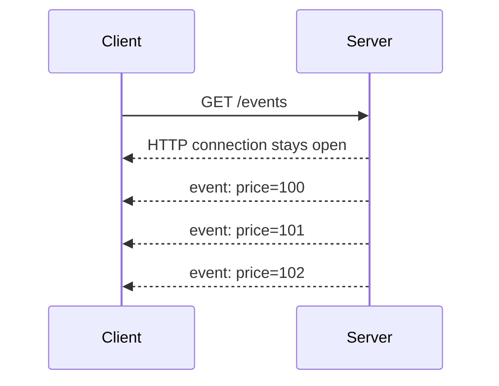
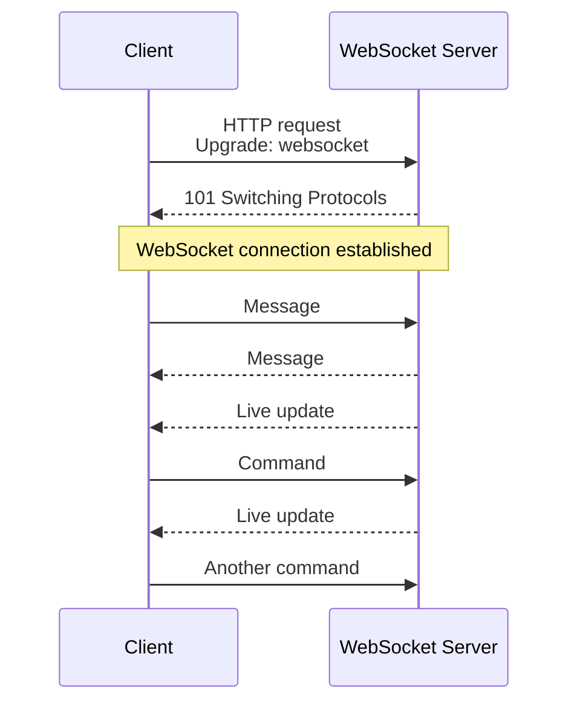
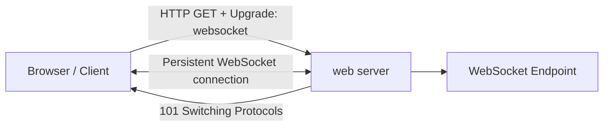
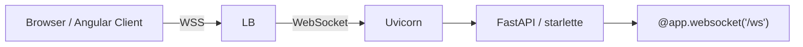

# Client-Server Architecture
**Concept**
- dns concept, `nslookup` command
- http 80 | https  8443
- [Socket](05_concept_03_socket.md) 👈🏻

## Overview




| Scenario          | Pattern            | Connection        | Direction              | Good for                      |
| ----------------- | ------------------ | ----------------- | ---------------------- | ----------------------------- |
| HTTP / REST / RPC | Request → Response | Usually reusable  | Client ↔ Server        | APIs                          |
| Polling           | Pull               | Repeated requests | Client → Server        | Simple status checks          |
| SSE               | Push stream        | Long-lived HTTP   | Server → Client        | Notifications/live feeds      |
| Fan-out           | Distribution       | Varies            | One → Many             | Kafka/pub-sub                 |
| WebSocket         | Streaming          | Long-lived        | Client ↔ Server        | Chat, trading, real-time apps |
| gRPC streaming    | Streaming RPC      | Long-lived HTTP/2 | One or both directions | Service-to-service streaming  |

---
## scenario-1: Request/Response
### 💠 TCP/IP (Transmission Control Protocol) 
> **PASSIVE SERVER**, reply only if client requests

TCP handshake:
- Creates a reliable, stateful connection between two endpoints.
- Connection starts with 3-way handshake: SYN → SYN-ACK → ACK
- Identified by: Source IP + Source Port + Destination IP + Destination Port
- **Provides ordering, acknowledgments, retransmission, flow control, and congestion control**
- TCP itself does not encrypt data; TLS provides encryption.

```
    TCP = reliable pipe
    TLS = secure pipe
    HTTP = language spoken through the pipe
```

---
### 💠 HTTP / HTTPS(TLS)
A stateless, text-based protocol commonly used for APIs.
- HTTP connection : HTTP protocol --> TCP handshake
- HTTPS connection : [HTTP --> TCP handshake --> TLS handshake](../SD_03_security/03_protocol_https_tls.md)
- **short live stateless connection.** : open-close, open-close, ...
- Also **handshake takes time.**
- use case - REST API

---
### 💠 GRPC...
- **Description**: A high-performance, open-source RPC framework by Google.
- **Key Features**:
    - Uses Protocol Buffers (Protobuf) for serialization.
    - Supports bi-directional streaming.
    - Highly efficient binary format.
- **Common Use Cases**:
    - Low-latency communication in microservices.
    - Distributed systems needing real-time communication.
- **Supported by**: Google Cloud, gRPC libraries.


---
## Scenario-2: Data Updates — Polling, SSE, Fan-out
### 💠 Short Polling
- https://www.youtube.com/watch?v=b4qyOpGg748
- client repeatedly requests data from a server **at set intervals** 
  - using any network protocol.eg: https, etc
- **problem** : it creates many new connections and often results in empty responses.
- eg:
  - Temperature Monitoring
  - AJAX application polls bts
  - not ideal for real-time applications like chat
- **reducing** the polling interval
  -  it significantly increases the **load on the server**, 
  - as clients send many **unnecessary requests**.
  


### 💠 Long Polling
- A variation where the server **holds the client's request** 
  - `hanging GET (with timeout)` 👈🏻
- until data is available **or** a timeout occurs
  - This allows the server to "push" information, 
  - but clients still need to reconnect periodically after timeouts
  - https://www.youtube.com/watch?v=pnj3Jbho5Ck (02:00)

**problem**: since holds client's request, thus resource intensive.


### 💠 Fan-out 


Twitter 2012-2013 problem : https://www.youtube.com/watch?v=FEkXjNFrL1o
```
Twitter had 150 million users 
 handled write - 6,000 tweets per second. 
 Challenge-1:
  - read requests: 300,000 requests per second to serve homepages
    - User timeline 
    - Home timeline
  - Fix-1: Adding indices speeds up reads but slows down writes.
           Since reads are more frequent than writes, this is a fair trade-off.
           
  - Fix-2: 
    - pre-computed and stored user home timelines in a Redis cluster
    - Twitter serves the cached timeline from Redis, significantly reducing latency
    - When a user tweets, the tweet is replicated into the home timeline queue of each follower, 
    - resulting in thousands of writes to redis, for a single tweet
    - this is fanOut 👈🏻
  
```


---
### 💠 SSE
- server sent event
- designed for streaming **textual data** over HTTP
- SSE is a unidirectional protocol
- server pushes data to the client over a single, long-lived HTTP connection.


### 💠 webhook (sync Event-driven)
- just **Http Post** with event data.
- https://www.youtube.com/watch?v=oQaJn6RdA3
- traditional: polling, long-live connection
    - eating resources
- Webhooks allow servers
    - to notify client applications
    - only when new events occur, rather than requiring clients to check periodically.
- eg: gitHub make post call --> harness trigger (POST /api, idempotent), payload: {eventId...}
- benefit:
    - Webhooks improve system performance,
    - reduce latency,
    - and are crucial in modern microservices architectures for enabling system decoupling

**Example for CI/CD pipeline in AWS**
- https://youtu.be/9zfAqoTm4-Q?si=_PGo_F1tcNZvuxyi
- 

---
## Scenario-3. Bidirectional 
### 💠 WebSocket / WSS
- **ACTIVE SERVER**, proactively reply/push to client, with even client requesting/polling
- Streaming https://www.youtube.com/watch?v=b4qyOpGg748
- Full Duplex async messaging: - https://www.youtube.com/watch?v=pnj3Jbho5Ck  | https://www.youtube.com/watch?v=G0_e02DdH7I
- the client opening a **long-lived connection** with the server,
- typically through a **socket**, 👈
- allowing the server to **push** information **without a client request**
- Analogy: client opens a file and server can write any moment until client closes file.

```
        Persistent connection:
Client  ◄══════════════════════► Server
          send / receive
          send / receive
          send / receive
```



- `ws`://localhost:8080/myapp/chat | `wss`://localhost:8080/myapp/chat
- check short and Long Polling problem.
- Flow:
    - **Https/TCP handshake** === same
    - **negotiate to upgrade** to WS with request header:
        - `Upgrade: websocket`,
        - `Connection: Upgrade`,
        - `Sec-WebSocket-Key: xxxxxxxx`
    - server validates:
        - response code `101` / Switching Protocols,
        - response header:
            - `Sec-WebSocket-Accept: zzzzzzzzz`,
            - which is generated by concatenating the client's key with a GUID
            - and applying SHA-1 hashing.
    - establishes a persistent, **bi-directional connection**/ tunnel
    - both client/server,
        - can stream **data frame**, uninterrupted 👈🏻
        - simultaneous sending and receiving
    - either, initiate close connection

**Data frame**
```
FIN bit : Indicates if it's the final fragment of a message.
RSV bits : Reserved for future use.
Opcode : Defines the type of data (text, binary, ping, etc.).
Mask bit : Indicates if the payload data is masked (always for client-to-server frames).
Payload length : Defines the length of the data.
Masking key : Used to obscure payload data.
```
**Masking**

**Fragmentation**
- splitting large messages into smaller chunks
- to prevent buffer overflow
- and allow for gradual delivery of data.
- The FIN bit is used to indicate whether a fragment is the final part of a message.

**Real-time applications**
```
WebSockets are ideal for:
    Stock trading websites displaying live price fluctuations 
    Chat applications
    Gaming applications that require automatic UI refreshes
```

---
### 💠 Videos Streaming / ABS
- https://www.youtube.com/watch?v=kCAXpAikMVc
- ABS **Adaptive Bitrate Streaming**
  - adjusts video quality based on the viewer's internet
  - ABS works by encoding video at **multiple bitrates**
- Types of Video Streaming
  - Live streaming: 
  - On-demand streaming
  - Peer-to-peer streaming: Distributing content where viewers share their bandwidth and computing resources
#### DASH - Dynamic Adaptive Streaming over HTTP 

#### HLS - HTTP Live Streaming
#### RTMP - realTime messaging Prot

---

## More scenario/s
### 💠 Peer 2 Peer
https://www.youtube.com/watch?v=2v6KqRB7adg

 


**Example of transferring large video files to thousands of machines**
1. single server approach (10 videos, 5GB each) - `15 min`
2. sharding, 5 server (2 videos each, 5GB each) - `15/5 = 3 min`
3. P2P solution - `1 sec`
    -  large file is split into small chunks and distributed among peers
    - These peers then communicate with each other in **parallel** to assemble the complete file
    - **peer discovery**
    - **peer selection strategies** within a P2P network
    - Centralized database (tracker), Gossip protocol, distributed hash table (DHT)

