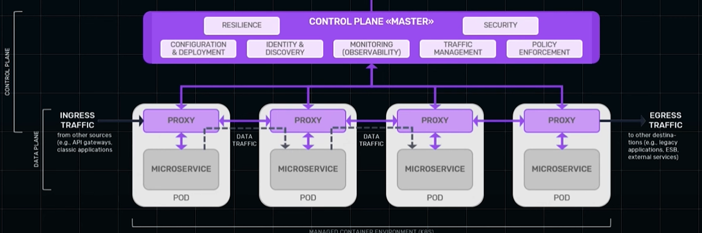

# Service mesh in micro-service
## Overview
> tools: Istio, Linkerd (lightweight), and Consul

**reference**
- https://www.youtube.com/watch?v=xuOJF3w4vQQ
- https://www.youtube.com/watch?v=sh2nwXJLDkE 
 
**Sidecar proxies** 
- component deployed alongside each service.
- it intercepts all in/out network traffic. 👈
- Allows the main service to focus on its core logic,
- while the sidecar handles below complexities.
- **helper process**

**Service-mesh**
- infrastructure layer that simplifies,
    - **synchronous service-to-service** communication in a microservices architecture
    - without requiring changes to the service code 👈🏻
    - uses Sidecar proxies

- Challenges 
  - increased **resource** consumption, 
  - and potential **latency** due to extra communication hops
  

---
## key aspects
✔️Separation of Concerns
- It cleanly separates **non-business logic** from the core service,
- making the application code simpler and more focused.

✔️Standardization
- Using sidecars across multiple services creates a standardized approach
- for **cross-cutting/infra concerns** like
    - security
    - observability (log, trace, metric)
    - communication (traffic routing, lb, etc)
    - service-mesh (eg; istio sidecar)
    - ...

✔️Flexibility and Scalability
- Sidecars can be built in different languages or frameworks
- and scaled independently based on demand

---
## Handles complexities like:
**Fault Tolerance**
- retries on network failure
- ...

**security**
- encrypted communication (mTLS)
- ...

**traffic**
- load balancing - Routes traffic based on versions, load conditions, or user-specific rules
- zero-downtime deployments / Canary deployments / eg: 10% to v2(new) and 90% to v1 (old)

**Observability**
- Provides built-in tools like distributed tracing 
- and metrics collection to monitor service interactions
- ...
