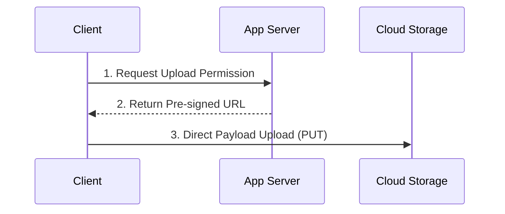

# pre-signed URL Arch
- https://academy.bytemonk.io/products/system-design-mastery-beta/categories/2158360643/posts/2192532094
- Modern arch - separation of concern:
  - **Application plane** (generate pre-signed URL and share to user.)
  - **Data plane** (Direct flow of data between user and cloud storage)
  
> Example: Youtube video upload, AWS s3 object upload, etc

---
## Overview
- temporary, secure URL generated by an application server 
- that grants time-limited access (read or write permissions) 
- directly to a specific resource in cloud storage (such as AWS S3 or Google Cloud Storage) 
- without exposing private storage credentials to the client.

Direct Upload Workflow (`PUT` Request)

---

## 🔑 Key Benefits

### 1. Massive Scalability & Performance

* **Bypasses Application Server Bottlenecks:** Uploads and downloads stream directly between the client browser/mobile client and cloud storage.
* **Optimized Storage Transfers:** Cloud storage providers (like AWS S3) are built for high-throughput, parallel data streaming far beyond standard application servers.

### 2. Cost Efficiency

* **Eliminates Double Transfer Costs:**
Avoids ingress/egress bandwidth charges from routing heavy binary payload data through application servers before sending it to storage.
* **Lower Server Resource Usage:** Reduces CPU, memory, and thread pool consumption on backend instances.

### 3. Security & Access Control

* **No Credential Exposure:** Backend AWS/GCP access keys remain on the application server.
* **Fine-Grained Permissions:** 
  * Each generated URL can be locked to a specific operation (`GET` for download, `PUT` for upload),
  * a strict expiry duration (e.g., 5 minutes),
  * and specific HTTP headers/file names.

---

## ❓ Frequently Asked & Key Design Considerations

> **Q: Does sharing a pre-signed URL allow anyone else to use it?**
> 
> **Yes.** A pre-signed URL functions as a bearer token. Anyone possessing the URL can perform the signed operation until the expiration window closes.
> **Mitigations & Safeguards:**
> * Keep expiration windows short (e.g., 60–120 seconds for uploads).
> * Bind specific headers or request payloads where feasible.
> * Use secure HTTPS channels to prevent interception.

