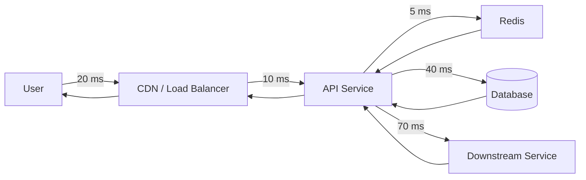
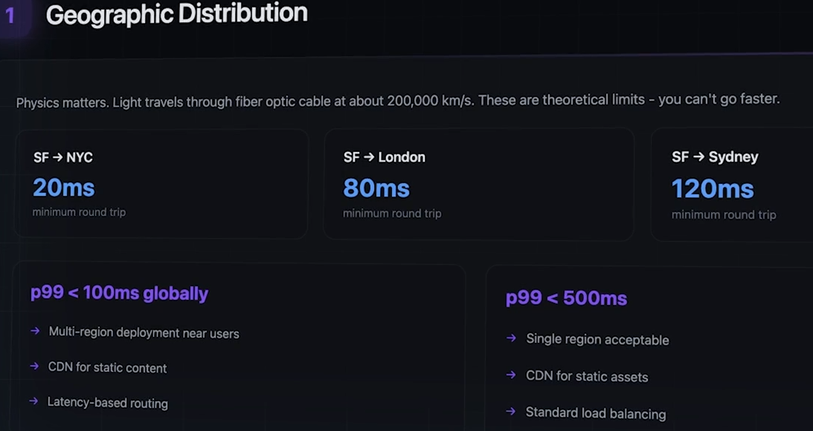
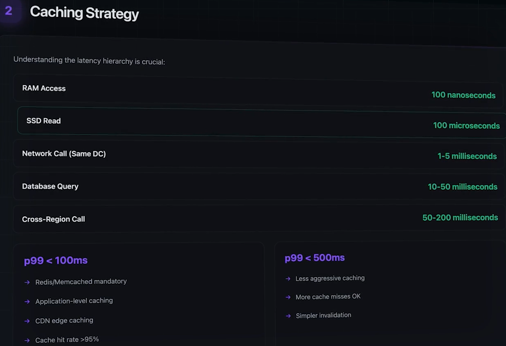
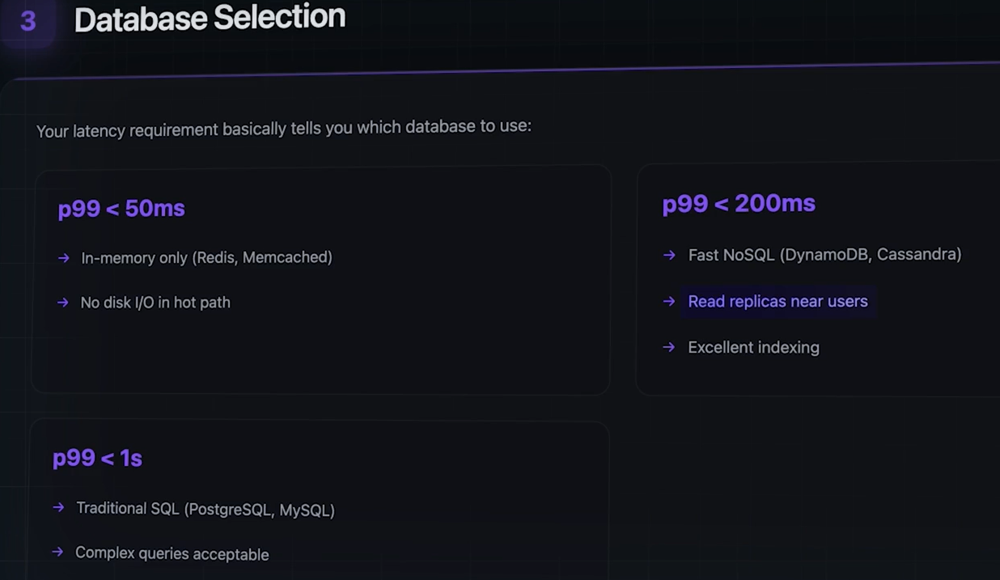
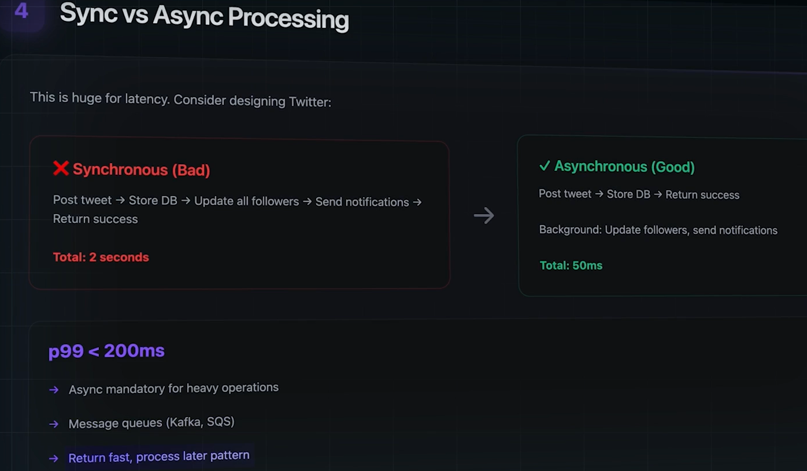
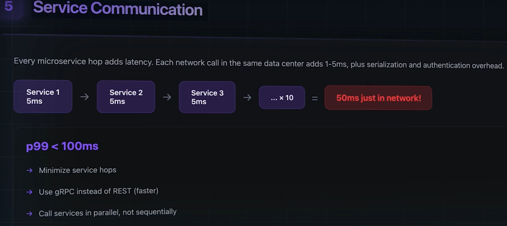
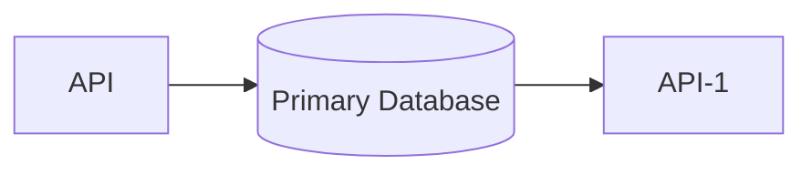
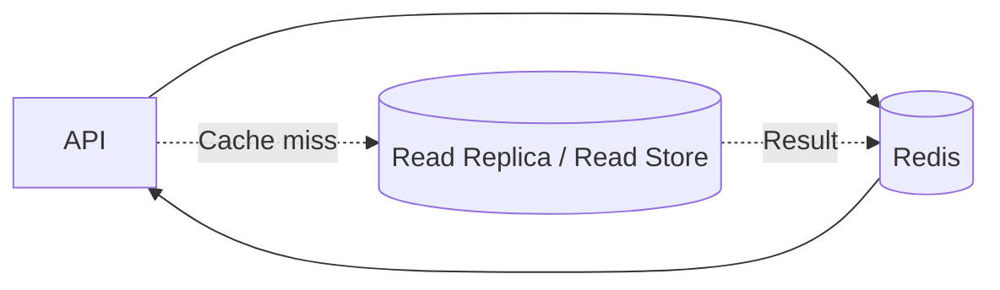
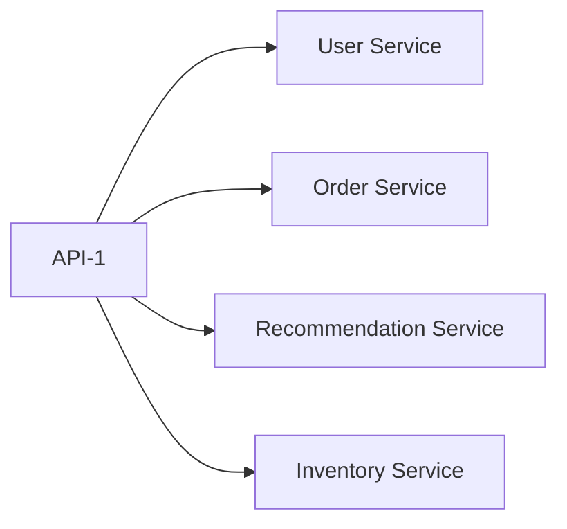
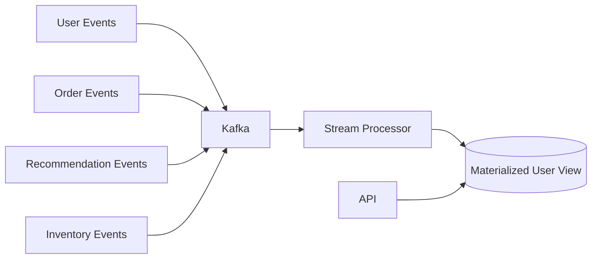

# BIG-2 of 3: Latency
- https://chatgpt.com/g/g-p-6a68d3926dd4819180c1c9bf855e98f3-system-design-bm-acedemy/c/6a68d435-d7dc-83e8-9947-5b90b0e3bd9f
- https://academy.bytemonk.io/products/system-design-mastery-beta/categories/2158857209/posts/2192532334
--- 
## Overview
- **latency has tradeoff with accuracy.** 👈
  - latency sensitive system : online games, video games, etc
  - latency tolerant system: Airline booking, banking system, etc
- Time taken for data to travel from one point in a system to another.
- **Response time (ms)** =  Queueing time+ Network time+ Processing time+ Dependency time
- **Latency (ms)** = Response received time − Request sent time
```
Request sent:     10:00:00.000
Response received:10:00:00.250
>>> Latency = 250 ms
---
Service A = 100 ms | Service B = 150 ms | Service C = 80 ms
- Total "sequential" dependency latency ≈ max(100, 150, 80) = 330 ms
- Total "parallel" dependency latency ≈ max(100, 150, 80) - 150 ms
```
## understand latency
### By Latency Scale
| Operation                 |                Approximate scale |
| ------------------------- | -------------------------------: |
| CPU or memory operation   |                      Nanoseconds |
| Local cache lookup        | Microseconds to low milliseconds |
| Redis call in same region |                    Around 1–5 ms |
| Database query            |                 Around 5–100+ ms |
| Internal service API call |                Around 10–100+ ms |
| Cross-region call         |                Around 50–300+ ms |
| Third-party API           | Around 100 ms to several seconds |
| Batch job                 |                 Seconds to hours |

```
 1MB READ Data from:
    memory        - 250  microSec   | storage latency
    SSD           - 1000 microSec   | storage latency
    1GBPS network - 10k  microSec   | Network latency
    HDD           - 20k  microSec   | storage latency
```
---
### Latency benchmark (per human phycology)
| Use case                        | Recommended **p99 latency** | Human perception                                |
| ------------------------------- | --------------------------: | ----------------------------------------------- |
| Typing, autocomplete, drag/drop |                **< 100 ms** | Feels instantaneous                             |
| Button click, API response      |                **< 300 ms** | Feels highly responsive                         |
| Search results, page navigation |              **< 1 second** | User’s thought flow remains uninterrupted       |
| Login, payment confirmation     |             **< 2 seconds** | Acceptable for important operations             |
| Complex dashboard/report        |             **< 5 seconds** | Noticeable delay; show loading/progress         |
| Long-running operation          |            **> 10 seconds** | User may lose attention; process asynchronously |

---
### By Examples

```
End-to-end latency is created by the entire request path, not just application code

Network to server        = 20 ms
Load balancer            = 5 ms
Application processing   = 15 ms
Database query           = 40 ms
Downstream service       = 70 ms
Response network         = 20 ms
--------------------------------
Total latency            = 170 ms
```
---
## Latency metrics 👈
**Latency requirement example**
- **Bad requirement**: The application should be `fast`.
- **Better requirement**: The read API should respond within `200 ms at p95.`
- **Even better**: The read API should have:
    - `p50 below 80 ms`
    - `p95 below 200 ms`
    - `p99 below 500 ms`
  
**Evaluate** https://www.youtube.com/watch?v=lJ4NEMNBeS4
- average:
- Max:
- min:
- **Median latency**:  sort the data set and determining the middle position. (mid+midNext)/2 for even.
- **Percentile latency** : sort the data and determine the percentile position.
    - P50 : 50 % of total reqs, executed with in `80ms`
    - P90 : 90 % of total reqs, executed with in `150ms`
    - P95 : 95 % of total reqs, executed with in `200ms`
    - P99 : 99 % of total reqs, executed with in `200ms`
```
Example
Request 1  → 150 ms
Request 2  → 60 ms
Request 3  → 500 ms
Request 4  → 80 ms
Request 5  → 120 ms
Request 6  → 50 ms
Request 7  → 200 ms
Request 8  → 90 ms
Request 9  → 70 ms
Request 10 → 100 ms

total item = 10
p50 == 50 of 10 == 5 == check postion 5

Fastest                                  Slowest
   ↓                                        ↓
50  60  70  80  90 | 100  120  150  200  500
                    ↑
                  P50 area
```
---
## Design Decision










---
## TradeOff
| Lower-latency technique   | Trade-off                                |
|---------------------------| ---------------------------------------- |
| Caching                   | Stale data, invalidation complexity      |
| Multi-region deployment   | Higher cost, replication complexity      |
| Precomputed views         | More storage, delayed freshness          |
| Eventual consistency      | Users may briefly see old data           |
| Async processing          | Work completes later                     |
| Denormalization SQL table | Duplicate data, harder updates           |
| Fewer service calls       | Less service independence                |
| Pre-warmed capacity       | Higher idle infrastructure cost          |
| Strict timeouts           | More failed or partial responses         |
| No retries                | Faster failure, lower success rate       |
| Parallel calls            | Higher load on dependencies              |
| Edge/CDN caching          | Harder personalization and cache control |

**Source: ByteMonk**

| Category    | Lower-latency approach        | Trade-off                                             |
| ----------- | ----------------------------- | ----------------------------------------------------- |
| Cost        | In-memory databases           | Much higher infrastructure cost                       |
| Cost        | Multi-region deployment       | More compute, networking and replication cost         |
| Cost        | Aggressive caching            | Additional cache infrastructure and maintenance       |
| Complexity  | Multiple caching layers       | Difficult cache invalidation; stale-data risk         |
| Complexity  | Multi-region data             | Synchronization and conflict-resolution complexity    |
| Processing  | Asynchronous workflows        | Harder debugging, tracing and failure recovery        |
| Operations  | More monitoring               | Higher observability and operational overhead         |
| Team        | More specialized architecture | Larger team and steeper learning curve                |
| Consistency | Local caches and replicas     | Eventual consistency may be required                  |

---
## Architecture shift : example
> - let say have to build system with p99 - 500 ms first.
> - same system needs shift to p100 ms 
> - then what will be architecture shift need to be made >

| Category      | Area                | p99 ≤ 500 ms architecture                         | p99 ≤ 100 ms architecture shift                                  |
| ------------- | ------------------- | ------------------------------------------------- | ---------------------------------------------------------------- |
| Network       | User location       | One regional deployment may work                  | Deploy closer to users using multi-region or edge                |
| Network       | Static content      | Application server may serve it                   | CDN serves static and cacheable responses                        |
| Data          | Database access     | Direct database reads are acceptable              | Cache-first reads; remove primary DB from hot path               |
| Data          | Database location   | Cross-AZ access is usually acceptable             | Keep reads in the same region; minimize network distance         |
| Data          | Data model          | Normalized relational model may work              | Use denormalized or precomputed read models                      |
| Data          | Consistency         | Strong consistency is often possible              | Eventual consistency may be required                             |
| Services      | Service calls       | Several sequential calls may fit                  | Parallelize or eliminate downstream calls                        |
| Services      | Microservice hops   | Three to five synchronous hops may work           | Limit to one or two synchronous hops                             |
| Services      | Aggregation         | Aggregate data during the request                 | Precompute and store materialized views                          |
| Caching       | Application caching | Optional performance optimization                 | Core part of the architecture                                    |
| Processing    | Writes              | Database write plus processing can be synchronous | Persist minimum data; move secondary processing async            |
| Processing    | Background work     | Notifications and analytics may run synchronously | Use Kafka or queues for non-critical work                        |
| Security      | Authentication      | Remote token introspection may work               | Validate JWT locally using cached JWKS                           |
| Runtime       | Cold starts         | Occasional cold starts may be acceptable          | Use pre-warmed instances and minimum capacity                    |
| Reliability   | Retries             | Limited retries may fit inside the request        | Prefer strict timeouts and fast fallback; avoid request retries  |
| Reliability   | Dependency failure  | Wait for most dependencies                        | Return partial or degraded responses                             |
| Scaling       | Autoscaling         | CPU-based reactive scaling may be enough          | Predictive scaling using latency, concurrency and queue depth    |
| Observability | Monitoring          | Average, p95 and service-level metrics            | Track p99 for every dependency and request segment               |
| Logging       | Logging             | Detailed synchronous logging may still fit        | Use asynchronous structured logging                              |
| Deployment    | Regional model      | Single-region active deployment                   | Multi-region active-active or regional edge routing              |
| Cost          | Infrastructure      | Moderate infrastructure cost                      | Higher cost due to cache, replicas, pre-warming and multi-region |

**✔️Remove the database from the critical path (before/after)**


**✔️Replace runtime aggregation with precomputation (before/after)**


**✔️Reduce synchronous service hops**

| Request structure                      | Approximate effect                               |
| -------------------------------------- | ------------------------------------------------ |
| API → database                         | Usually manageable                               |
| API → service → database               | Higher latency                                   |
| API → service A → service B → database | Difficult for 100 ms                             |
| API → cache/read model                 | Best fit                                         |
| API → multiple services in parallel    | Better than sequential, but tail latency remains |
| API → precomputed result               | Most predictable                                 |

**✔️more**
- better **storage device** | use caching (HDD --> RAM)
- better **network protocol** (https --> http --> TCP/UDP)
- **Parallel execution** reduces latency, but increases rink of concurrency issues.

---
## 🙏 Interview
### Ask these:
1. What is the expected latency target? 
2. Is the target for p50, p95, or p99?
3. Is latency measured from the client or server?
4. Are users located globally?
5. Can some operations be asynchronous?
6. Is slightly stale data acceptable?
7. Which operations are latency-sensitive?

### Common mistake:
|  # | Mistake                                  | Better approach                                                          |
| -: | ---------------------------------------- | ------------------------------------------------------------------------ |
|  1 | Discussing only average latency          | Use **p50, p95 and p99** because averages hide slow users                |
|  2 | Ignoring network physics                 | Consider user-to-region distance; use edge or multi-region when required |
|  3 | Ignoring the full request chain          | Calculate latency across every synchronous service and database call     |
|  4 | Assuming every request is a cache hit    | Discuss cache misses, cold starts, warming and invalidation              |
|  5 | Over-engineering for unnecessary latency | Match the latency target to the actual business requirement              |

**Interview reminders**
- Sequential calls add up: 5 services × 50 ms = 250 ms.
- Parallel calls reduce the dependency portion toward the slowest call, but increase load and failure complexity.
- A **cache-hit** latency target is incomplete 
  - unless the **cache-miss** path also meets an acceptable target.
- Do not promise global 50 ms latency from one region.
- Start simple, measure, and optimize the actual bottleneck.

