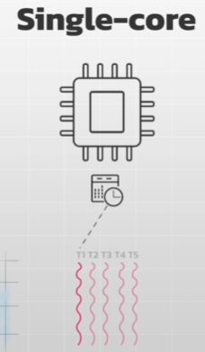
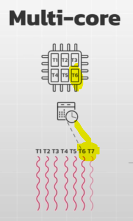

# Task Executions Flow
https://youtu.be/zOhiZJn-5cY?si=N88gyw7TQ_SR5InX
> In modern Distributed systems, these concepts often combine. 
> 
> Multiple threads run 
> - **concurrently** (managed by a scheduler) 
> - and some threads may execute in **parallel**, on different cores, 
>   
> thus, maximizing efficiency and scalability
---
## 1. Sequential

---
## 2. parallelism ✔️
- Multiple tasks are performed simultaneously,
- using multiple processing units (cores).
- It significantly speeds up processing time for independent tasks.
- Archived on:
  - multi-core system
  - nodes in cluster

---
## 3. Concurrency ✔️
> analogy: juggler keeping multiple balls in the air.
> 
> - managing Shared  resource 
> - efficient CPU utilization.
- Managing multiple tasks, 
- Giving the illusion of simultaneous execution,
- with **context switching**
- Achieved on :
  - single-core system: concurrency is achieved through rapid switching between tasks
  - multi-core system: both concurrency and parallelism can be achieved

- Check java Threads, concepts
- nodeJS, no threads.

 

