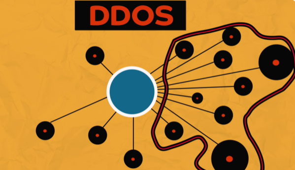
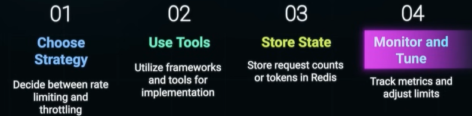
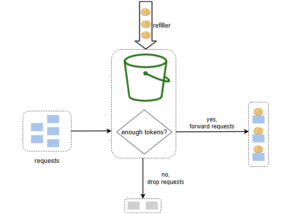
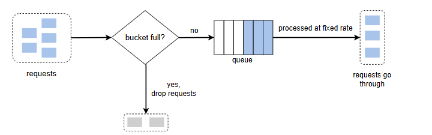
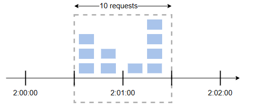
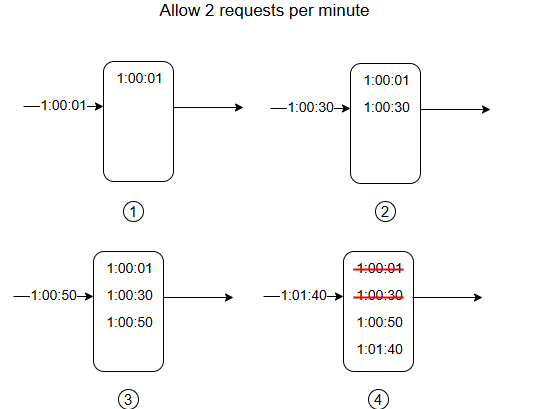

# Rate limiting and throttling
> crucial aspect of system design, especially in large-scale distributed systems
> 
> DDOS - Distributed DOS
> 
> 

---
## ✔️Overview
> - Systems often implement both, starting with throttling and moving to rate limiting if capacity is still threatened
> - best place to implement is on : [📚API-gateway](02_api_02_apiGateway.md)
> - https://www.youtube.com/watch?v=_qNHROq0pGk bm

### Rate Limiting
- https://bytebytego.com/courses/system-design-interview/design-a-rate-limiter
- thresholds / **strict cap** on operations
  - ensuring that if a certain number of requests are exceeded within a given time frame.
  - Requests exceeding the limit are blocked or receive a `429` Too Many Requests error.
- safeguards systems, from: 
  - preventing brute-force attacks
  - Denial of Service (DoS) + DDOS
- **Type**:
    - user-based
    - geographic-based
    - server-based

### Throttling
- **Slows down the rate of requests** by:
    - delaying them
    - or limiting processing resources,
- rather than **rejecting them outright**.
- Useful for maintaining service availability under heavy load,
- ensuring all requests are **eventually served**
- **Type**:
  - Dynamic  Throttling: adjusts based on real-time metrics like CPU load
  - Adaptive Throttling: uses machine learning to predict spike

---
## ✔️Algo
https://bytebytego.com/courses/system-design-interview/design-a-rate-limiter

**Token bucket** `(rate-limit)`
- bucket with token, refilled at interval  === **Refill rate**
- but with pre-defined capacity (to hold limited token)  === **Bucket size**
- have to tune these params well

---
**Leaking bucket** `(throttle)`
- no token thing.
- Bucket has **capacity** (to hold request)  === **Bucket size**
- bucket has **leak**, for constant rate processing === `FIFO queue`

---
**Fixed window counter**
- divides the timeline into fix-sized time windows 
- and assign a **threshold counter** ,  for each window
- Each request:
  - increments the counter by one.
  - NOT logging request-time 🔺
- Once the counter reaches the threshold, new requests are dropped **until a new time window starts.**
- problem:  **burst of traffic at the edges of time windows**
  - 

---
**Sliding window log**
- variation for above to fix that edge burst problem
- algo:
  - also **log** request-time, when any request comes.
  - when next window state, it clean-ups all logs older that interval (1 min)
  - this way we: 
    - start new window 
    - then slide it to left till time (last request in **log**)

---
**Sliding window counter**