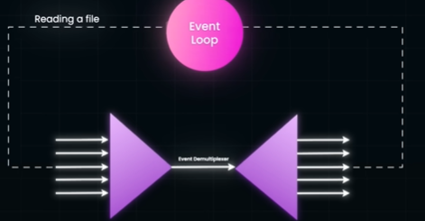
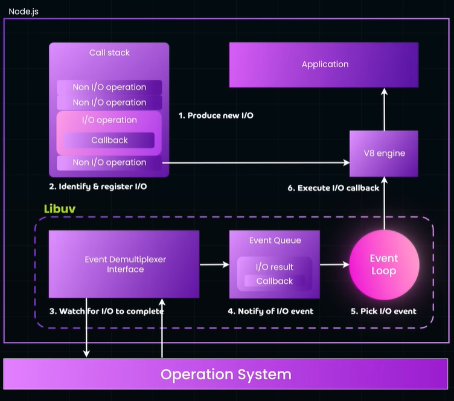
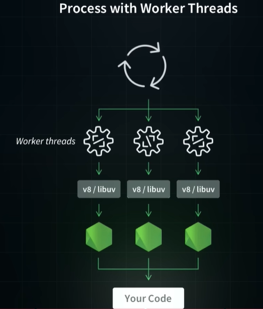

# Event-loop Architecture
> - slow request should not prevent other requests from being processed instantly.
> - event-driven, non-blocking architecture
> 
> 

---
## Overview/concept
- A **single-threaded model** with Event-loop + event demultiplexer + worker thread to:
  - handle asynchronous operations / non-blocking
  - and achieves high concurrency

💠**Event-loop**
  - it continuously checks for new request/task/functions/etc
  - **delegates i/o blocking tasks:**
    - to an **event demultiplexer**
    - Demultiplexer monitors the I/O operation 
    - notifies the event loop upon completion
  - **delegate CPU-intensive tasks:**
    - Worker threads
    - notifies event-loop upon completion

💠**Event Demultiplexer**
- https://www.youtube.com/watch?v=h125O5yvdg0
- fast i/o operation:
  - **RAM access**, which takes `nanoseconds` fast i/o
- slow i/o operation:
  - **disk access**, **network calls**, take `milliseconds`
  - **user interactions with mouse/keyboard**, takes  `minutes`
  - API call
- CPU-intensive operation
  - image processing
  - cryptography
  - etc

> process-1 (thread-1, thread-2, ..., all share same memory and cpu for process.)
> 
> - When a **thread** encounters an I/O task, 
> - it becomes blocked, 
> - causing the **CPU to sit idle**
> 
> Solution-1
> -  **spin NEW seperate child-thread for each i/o task** 
>   - might seem like a solution,  but
>   - managing numerous threads can lead to issues like race conditions or deadlocks,
>   - ultimately slowing down performance
>
> Solution-2
> - A more efficient solution is the **Event Demultiplexer** 👈🏻
> - offloading CPU-intensive tasks to internal-worker-threads

---
## ✔️Event-loop : OS
Operating systems provide built-in support for **Event Demultiplexer**
- Linux uses `epoll`
- Mac OS uses `kqueue`
- Windows uses `IOCP`

---
## ✔️Event-loop : JavaScript
- **function calls** f1,f2, .... --> call stack (execution context object)
- i/o function delegated to browser webAPI (act as Event Demultiplexer)
- by event loop

---
## ✔️Event-loop : NodeJs Server
- https://www.youtube.com/watch?v=os7KcmJvtN4
- http requests --> ....
- Node.js utilizes the `libuv/c-lib` library
  - to implement the event demultiplexer concept

---
## ✔️Event-loop : NgInx 
- better arch than NodeJs server
- https://www.youtube.com/watch?v=I6dpN0geIb4&list=PLJq-63ZRPdBt423WbyAD1YZO0Ljo1pzvY&index=72
- uses `epoll` as demultiplexer concept

---
## ✔️Event-loop : uvicorn 

---
## 🔺Traditional : Apache 
- thread per request