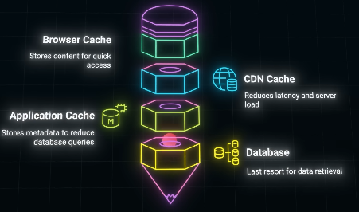

# API Caching
## ✔️ Overview
- https://www.youtube.com/watch?v=TV-xsNjbx_g bm
- caching is essential for optimizing REST API **performance**
  - reduces the load on databases
  - and speeds up response times
- done by storing frequently requested data **closer** to the client or server.
- [04_caching.md](../SD_02_database%2Bstorage/01_concept_04_caching.md)
- [04_caching-distributed.md](../SD_02_database%2Bstorage/01_concept_04_caching-distributed.md)

---
## ✔️ REST cache strategies
### Application Layer Caching
- This involves storing frequently accessed data in memory
- using tools like Redis or Memcached to minimize database queries.
- with TTL

---
### Request-Level Caching 
- caches entire API responses for specific requests
  - /resource/123
  - /resources?page=1

---
### Conditional Caching 
- This technique uses HTTP **headers**
  - `ETag`  === hash (responseData)
  - `Last-Modified` 
- to ensure clients only receive updated data, **when necessary** 
- thus reducing bandwidth usage. 

---
## ✔️ Layered cache 👈🏻
- most powerful approach involves implementing caching across multiple layers of the system

**Browser Cache**
- The fastest layer,
- storing content directly in the user's browser for instant access on repeat requests.

**CDN (Content Delivery Network)**
- A globally distributed network of servers that cache
- and serve content closer to the user, reducing latency.

**Server-Side/Application Layer Cache**
- Like Redis or Memcached
- storing metadata or frequently accessed data about resources.

