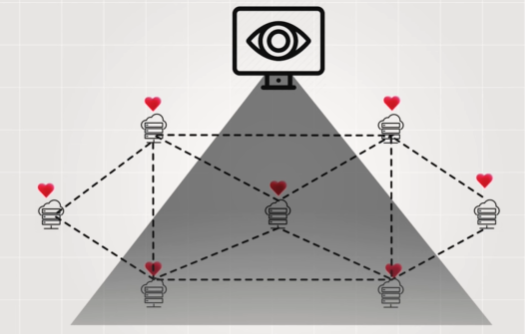
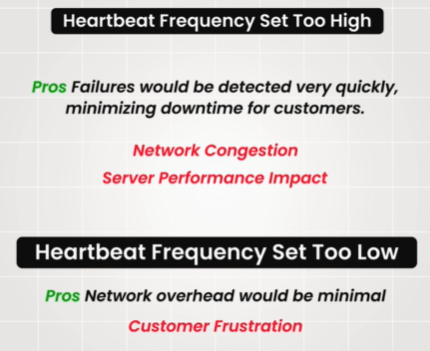
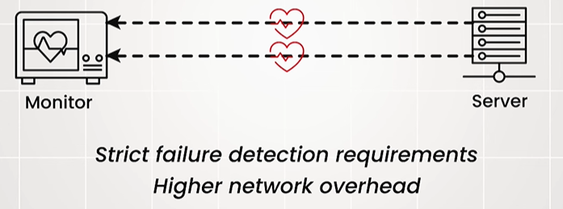
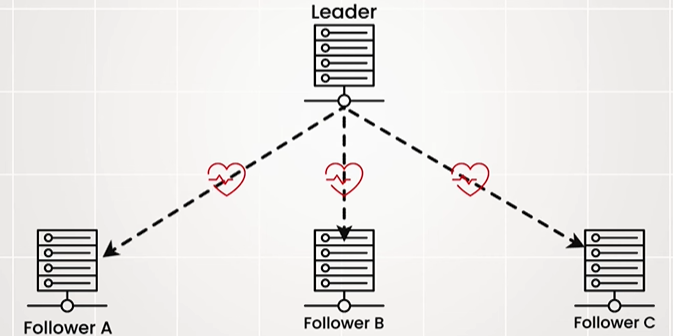

# heartbeat

## Overview
> a crucial mechanism for maintaining **system health and reliability in Highly DS**
- https://www.youtube.com/watch?v=2LCyDvx7iIE
- Sending **periodic** signals (Heartbeat Messages) between nodes to confirm: 
  - ensure system availability
  - detect operational status + unresponsive peers
  - detect failures in nodes
    - triggering failover mechanisms, if required
  - identify suitable node for tasks, among multiple healthy
  

  
**Heartbeat Messages**
- lightweight signals conveying a node's status
- simple pings
- payload depends on system.

**Monitor system**
- Dedicated system
- LB
- DataDog tool

**Frequency** 👈🏻👈🏻

--- 
## Heartbeat Detection Mechanisms
✔️**Based on network overhead and failure detection speed.**

### 💠**Push-based models**

- Nodes actively send their heartbeat signals at regular intervals (frequent) to designated **monitoring systems**
- Usefulness strict failure detection requirements
- potentially **increasing network congestion**.

--- 
### 💠**pull-based models**
- A **central monitoring system** periodically (not frequent) sends "are you alive" requests
- The other nodes then respond with a heartbeat message to **confirm their availability**.
- Nodes do not send unsolicited messages, which **reduces overall network traffic**. 👈🏻
- detected with a slight delay, since not frequent

--- 
### 💠**heartbeat with quorum**

- Leader-Based Heartbeats | [05_concept_01_LeaderElection.md](../SD_00_algo/03_algo_02_LeaderElection.md)
- majority vote is required to confirm availability. 
- Leader Nodes send heartbeat signals to multiple peers foloweer nodes
- Leader node is considered alive only if it receives a quorum (majority) of acknowledgment responses from its peers.
- benefit:
  - Reduced Risk of Incorrect Detection
  - Suitable for High Fault Tolerance
- cons:
  - Significant Network Overhead
  - Managing and reaching quorum consensus adds complexity to the system.

---
### 💠**Gossip Protocols**
- used in CDN and any peer2peer n/w
- Servers share heartbeat information with **immediate neighbor node**
- who then propagate it, ensuring everyone stays informed