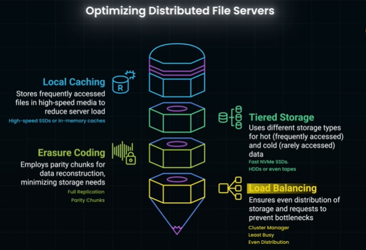

# Distributed file servers
## ✔️ Overview
**Simple file server**
- computer that stores and manages files, making them available to clients over a network.
- Allows multiple users to access, modify, and save shared documents
- Performance issues and system failure,
  - when too many users access it simultaneously or storage capacity is reached
  
**Distributed file server** / S3
- Stores across multiple servers helps overcome **single-server limitations**.
- chunk and store acros server/s **using LB.**
- Enables parallel retrieval, significantly speeding up downloads
- **Multi-Region Storage for Global Scale**
  - Users are directed to file servers in their nearest region
  - Cross-Region Replication: Ensures files exist in multiple locations for disaster recovery
  - eg: S3
- ✔️fault-tolerant - by replication or Erasure Coding
- ✔️consistency Model -Strong or eventual

---
## ✔️ Distributed FS - `consistency Model`
> Consistency - it defines how soon updates become visible across the system

💠**Strong Consistency**
- Every read operation always returns the most recent write
- Slows down writes 
  - system waits for all replicas to update
  - scalability challenge

💠**Eventual Consistency** :
- Updates propagate gradually; 
- for a short period, some users might see older versions
  - eg: S3 where new file versions might take time to fully propagate across regions
- Benefits: Allows faster writes and enables better scalability

💠**Mixed Consistency Models**  
- Allow developers to choose consistency levels
- Amazon S3 :
  - `new` objects immediately visible 
  - `updates/deletes` take time
- DynamoDB :
  - tune consistency **level per operation**

---
## ✔️ Distributed FS - `Fault Tolerance`
💠**Replication** 
- first chunking
- making copies of file chunks and storing them on multiple servers
- Ensures data availability even if one server fails
- But, Increases storage cost due to multiple full copies

💠**Erasure Coding** 
- 
- https://www.youtube.com/watch?v=VUxXH4uo4AY bm
- Cloud storage giants like AWS S3, Azure Blob Storage, and Google Cloud Storage utilize **erasure coding** to manage massive amounts of data cost-effectively and ensure durability.
- significantly reduces storage overhead compared to full replication
- `reed_solomon` py lib

- **How it Works**
  - The system splits a file into 'K' **data chunks**
  - and generates 'M' **parity chunks**.
  - These parity chunks store
      - mathematical patterns,
      - not copies,
      - allowing reconstruction of missing data 

---
## ✔️ Distributed FS - Optimization
