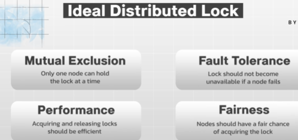
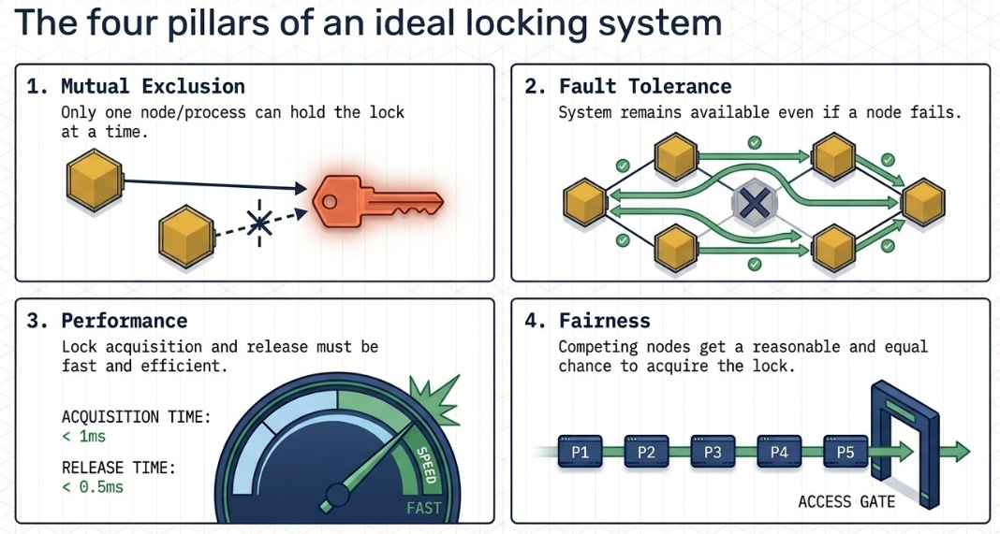

# Distributed Lock
## Overview
- https://www.youtube.com/watch?v=qY4MfWv01pI
- Ensures data integrity and consistency in distributed systems 
- by allowing only **one node** or process to access a shared resource at a time
- Solves:
  - race conditions
  - deadlocks

✔️ **ideal distributed locking principles**
- Ensuring only one node holds the lock.
- Guaranteeing lock availability even if a node fails.
  - **TTL**
- Efficient acquisition and release.
- Fair chance of acquiring the lock without starvation.

## Distributed locking algorithms
### **Centralized Locking**
- Simple 
- but less fault-tolerant
  - single point of failure 
- can be a performance bottleneck

### **Token-Based Locking**
- More fault-tolerant 
- but complex to implement

### **Quorum-Based Locking** (Redlock)
- Acquire lock on multiple resource

---
## Services
- **redis** 
  - java lib : `jedis` | options - NX, EX, etc
  - suitable for low latency
- **Zookeeper**
  - suitable for high consistency
- **etcd**
  - suitable for high consistency
  - distributed K-v store, Simple API
  - k8S env 👈🏻
- Database inbuilt lock (not recommended)

