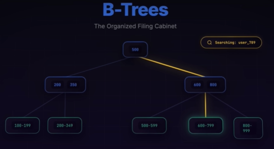

# Database Storage
- https://www.youtube.com/watch?v=Q9xD4J3tezw
- two main approaches: B-Trees and LSM Trees

> core problem :
> Significant speed difference between RAM and disk storage 
> with disks being much slower 100000 times

---
## B-tree
> PostgreSQL, MySQL, and SQLite
- **Writes**
  - more complex and slower 
  - as they involve finding the correct insertion point, 
  - splitting nodes, and rebalancing the tree, 
- **Reads** ✔️
  - ideal for `read-heavy workloads`
  - reads quickly. since tree is structured/organized, 
  - sorted tree structures
  - similar to a filing cabinet

---
## LSM (Log-Structured Merge Trees)
>  Cassandra, RocksDB, LevelDB, and HBase
- **Writes** ✔️
  - extremely fast due to sequential disk write.  `write-optimized workload`
  - Data is first written to an **in-memory** "memtable" 
  - and then sequentially flushed to disk as immutable "SS tables"
- **Reads** 
    - slower, as they may need to check multiple SS tables, 
    - mitigated by **Bloom filters**  and background **compaction processes**
      - that merge and organize files in the background.

