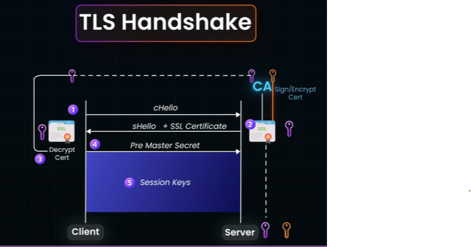
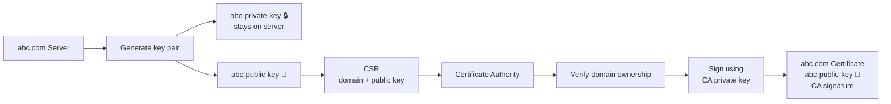
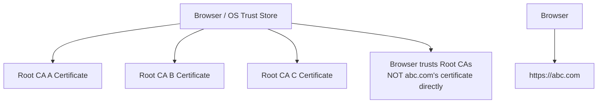
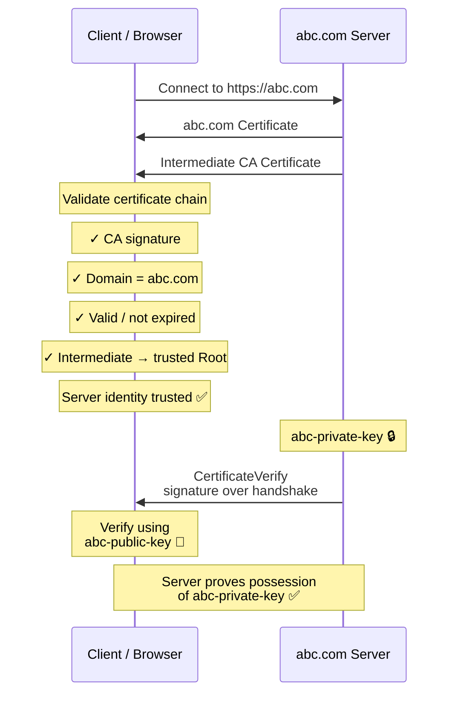
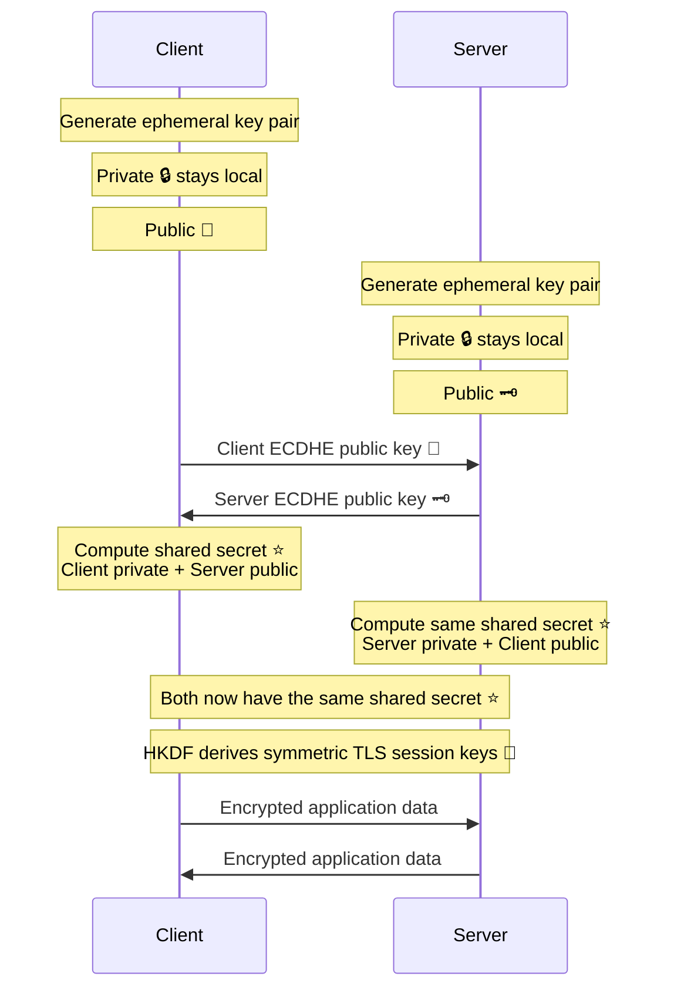

# HTTPS / TLS
## Overview

- **man in the middle** Attack with `http`
- TLS / transport layer security (level=4) | https (level=7)
- Its **TLS handshake**, which make Https connection secure, bts.
- All communication is encrypted with symmetric key exchanged between client and **trusted-server**.
- Servers identity is trusted by **Certificate** [x.509.](01_04_x.509.md)
> Certificates authenticate identity.They Do NOT encrypt application data.

---
## why need certificate (Skip)?
```
understand by Example
✔️Flow:
Server creates RSA key pair
Server shares "public-key" 👈🏻
symetric key (fast):
    cleint create preMasterSecret
    encrypt with public key
    server decrypts and get it.
Client encrypts data with symetric key
Server decrypts with symetric key

✔️Fatal flaw:
How does the client know the "public-key" actually belongs to the server?

That’s the classic Man-in-the-Middle (MITM) problem.
An attacker can replace the public key and transparently decrypt/re-encrypt traffic.

👉 Conclusion:
Encryption without authentication is useless on the internet.

This is exactly why TLS + certificates exist.
```


---
## Modern TLS 1.3
### 1. Certificate issuance (offline)
- Server (abc.com) generates key pair (abc-private-key + abc-public-key)
- Sends CSR to CA.
- CA verifies domain ownership
- CA signs certificate with CA-private-key
- CA issued public CERTIFICATE-1 [having abc-public-key + CA-signature]


### 2. Browser / OS trust store — offline



### 3. Server authentication


### 4. ECDHE → shared secret → symmetric keys

---
## mTLS
TLS + “UNO reverse card” for authentication 😄

| Aspect                         | TLS (one-way)         | mTLS (two-way)                           |
| ------------------------------ | --------------------- | ---------------------------------------- |
| Server authenticates to client | ✅                     | ✅                                        |
| Client authenticates to server | ❌                     | ✅                                        |
| Certificates used by           | Server only           | **Server + Client**                      |
| Use cases                      | Browsers, public APIs | Microservices, internal APIs, zero-trust |
---
## Encryption


