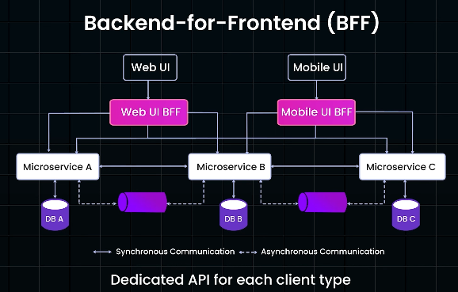

# Backend for Frontend (BFF)
# Overview
https://www.youtube.com/watch?v=Pmzrogq4W4I
> A **specialized service layer** that tailors backend services,
> for different client types like mobile, web, or IoT devices.

**Problem with General-Purpose APIs**
- A single API for all type of clients can lead to complex coordination between frontend and backend teams
- mobile experiences often differ significantly from desktop.
- Mobile devices, for instance, have less screen space, limit data display, and require unique interactions
- eg:
  - TV app might prioritize high-resolution content, 
  - while the mobile app focuses on data savings with lower resolution images

**Benefits**
- It optimizes data delivery, boosts performance
- allows frontend teams to focus on user interfaces 
- and reduces cross-team dependencies.

---
## BFF Strategies
- Dedicated BFF for each client type 
  - (e.g., separate BFFs for Android and iOS) 
- Single common BFF for multiple UIs. 