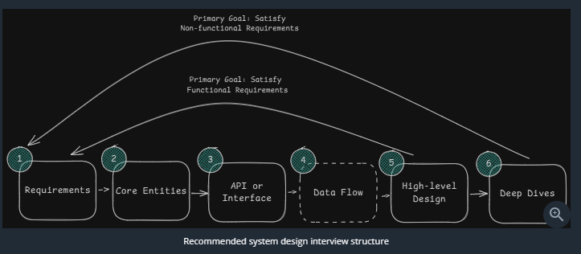

# Interview Delivery Sequence (45-Minute Flow)

## Phase 1: Requirements (~5 mins)**
* **Functional Requirements**: Pick and prioritize the top 2 to 3 core user capabilities (e.g., "Users can post tweets", "Users can view home feed").
* **Non-Functional Requirements**: Pick the top 3 to 5 system qualities with explicit targets (e.g., CAP preference, latency target < 200ms, scalability > 100M DAU, durability).
* **Capacity Estimation**: Skip upfront back-of-the-envelope math. Only compute numbers later when justifying architectural decisions (e.g., sharding or caching).

## Phase 2: Core Entities (~2 mins)**
* Identify 2 to 4 primary nouns and actors (e.g., `User`, `Tweet`, `Follow`).
* Keep it lightweight as a starting foundation; add schema details later.

## Phase 3: API Design (~5 mins)**
* Map endpoints directly to the functional requirements.
* Default to REST with plural resource nouns (e.g., `POST /v1/tweets`, `GET /v1/feed`).
* Extract user identity from auth tokens in headers, never from request body parameters.
* Note pagination (cursor-based for live feeds, offset-based for simple lists).

## Phase 4: [Optional] Data Flow (~5 mins)**
* Only for ingestion pipelines, web crawlers, or multi-step async workflows (e.g., Fetch -> Parse -> Extract -> Store -> Repeat).

## Phase 5: High-Level Design (HLD) (~10 to 15 mins)**
* Draw core components: Clients, Load Balancer / API Gateway, Stateless App Services, Primary DB.
* Walk through the data path endpoint-by-endpoint from request to storage.
* Document relevant database columns and relationships next to the DB box.
* Keep it simple first: do not over-engineer with caches or queues upfront; verbally note them for the deep dive.

## Phase 6: Deep Dives and Bottlenecks (~10 mins)**
* Scale and harden the design against the non-functional requirements.
* Address read/write bottlenecks, caching strategies, sharding, indexing, and edge cases.
* Proactively highlight trade-offs and collaborate on interviewer focus areas.## 1. Interview Delivery Sequence (45-Minute Flow)
