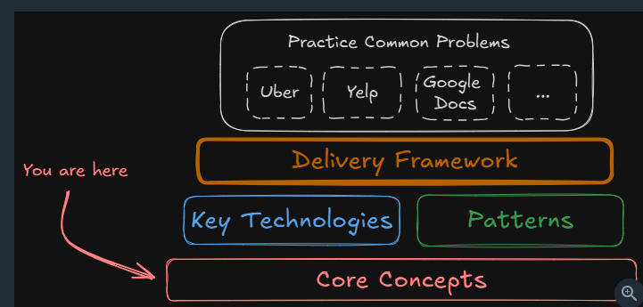

# Core Concepts Mental Model 
> When and How to Apply

## reference
 - https://www.hellointerview.com/learn/system-design/in-a-hurry/core-concepts
 - https://www.hellointerview.com/learn/courses/system-design/lesson/orientation/delivery

---

---
## Networking Essentials
* **Protocols**: Default to HTTP/REST over TCP. Use gRPC for internal service-to-service calls.
* **Real-time**: Use Server-Sent Events (SSE) for unidirectional server pushes (notifications, live updates). Use WebSockets only when true bidirectional communication is required (chat, collaborative editing).
* **Load Balancing**: Layer 7 (application routing by path/header) as default; Layer 4 (TCP level) for raw throughput and long-lived WebSocket connections.

[SD_04_network-essential](../../SD_04_network-essential)

## Data Modeling and Storage
> - sounds simple but has massive downstream effects on your system
> - directly affect performance, scalability

* **Relational (SQL)**: Structured entities, ACID transactions, relational joins (e.g., Postgres).
* **NoSQL**: Flexible schemas, heavy write throughput, horizontal scale without joins (e.g., DynamoDB, Cassandra).
* **Schema Design**: Default to normalized relational models. Denormalize only on specific hot read paths to eliminate expensive joins. In NoSQL, design partition and sort keys strictly around access patterns.

[SD_05_DataModeling](../../SD_05_DataModeling)

## Database Indexing
* **B-Tree**: Default primary/secondary index for exact match and range queries.
* **External Search**: Offload text search to Elasticsearch or geospatial queries to PostGIS/Spatial indexes, synced via Change Data Capture (CDC).

[03_DataStructure](../../SD_05_DataModeling/03_DataStructure)

## Caching Strategy
* **Pattern**: Cache-aside with Redis for read-heavy workloads (1ms cache hit vs. 20-50ms DB query).
* **Invalidation**: Write-invalidation or short TTLs depending on staleness tolerance.
* **Resilience**: Protect against cache stampedes / thundering herds via locking or early recomputation; handle cache outages with circuit breakers.

[01_01_caching.md](../../SD_06_think-in-scale/01_01_caching.md)

## Sharding and Scaling Writes
* **When to Shard**: Only after a single primary + read replicas cannot handle storage (> tens of TBs) or write throughput (> 10k to 50k TPS).
* **Shard Key**: Hash-based sharding on a primary entity (e.g., `user_id`) to evenly distribute data; explicitly acknowledge cross-shard aggregation trade-offs.

[01_02_sharding.md](../../SD_06_think-in-scale/01_02_sharding.md)

## Consistent Hashing
* Use for dynamic node membership in distributed caches (Redis Cluster, Memcached) or distributed databases (DynamoDB, Cassandra) to minimize data movement when adding/removing nodes.

[01_03_consistent-hashing.md](../../SD_06_think-in-scale/01_03_consistent-hashing.md)

## CAP Theorem and Consistency
* Network partitions are unavoidable in distributed systems.
* **Default**: Eventual consistency / high availability for feeds, comments, and public content.
* **Strong Consistency**: Mandatory for financial transactions, seat reservations, and inventory counts to prevent double-booking or overselling.

[01_04_CAP-theorem.md](../../SD_06_think-in-scale/01_04_CAP-theorem.md)

---

## Quick Reference Rules of Thumb

* **Latency Hierarchy**: Memory (nanoseconds) < SSD read (microseconds) < Intra-datacenter network (1 to 10ms) < Cross-region network (100ms+).
* **Redis Instance**: ~100k+ operations/sec, ~1ms latency.
* **Single Database Instance**: Up to ~10k to 50k transactions/sec, multiple terabytes of storage before requiring sharding.
* **Message Queue Broker**: Up to ~1M messages/sec per broker with sub-5ms latency.

[01_04_Numbers-to-know.md](../../SD_06_think-in-scale/01_04_Numbers-to-know.md)

---

## More:
### [the_patterns](../../SD_07_01_the_patterns)
### [key-technologies](../../SD_07_02_key-technologies)
### [Question breakdown](../../../SE_99_case-studies/04_helloInterview)
