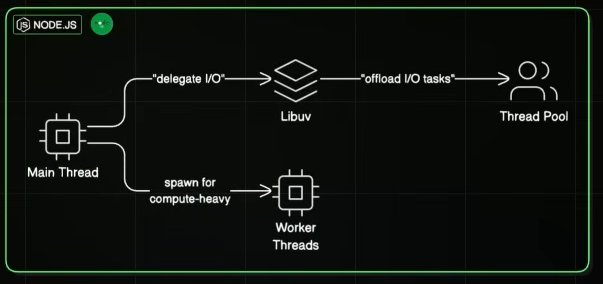
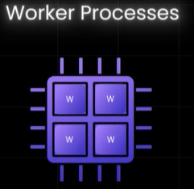
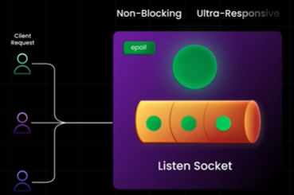
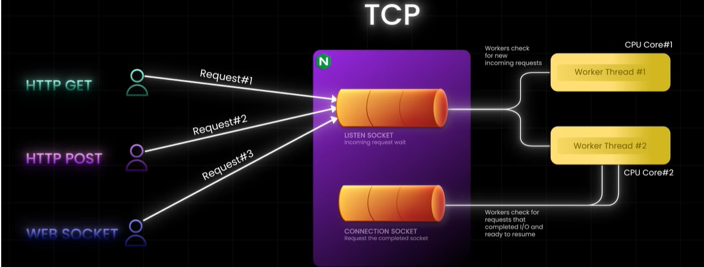
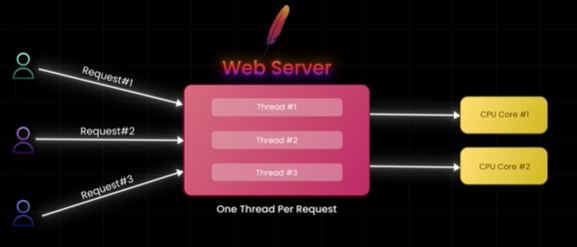

# Event-loop Architecture
## reference
- https://youtu.be/eiC58R16hb8?si=nubMfnkWG0SqjKNu | 
- https://www.youtube.com/watch?v=h125O5yvdg0 | Event Demultiplexer
- https://www.youtube.com/watch?v=os7KcmJvtN4 | nodejs server
- https://www.youtube.com/watch?v=I6dpN0geIb4&list=PLJq-63ZRPdBt423WbyAD1YZO0Ljo1pzvY&index=72 | ngInx

---
## Overview/concept
> - slow request should not prevent other requests from being processed instantly.
> - event-driven, non-blocking architecture
>
> 

- A **single-threaded model** with Event-loop + event demultiplexer + worker thread to:
  - handle asynchronous operations / non-blocking
  - and achieves high concurrency

💠**Event-loop**
  - it continuously checks for new request/task/functions/etc
  - **delegates i/o blocking tasks:**
    - to an **event demultiplexer**
    - Demultiplexer monitors the I/O operation 
    - notifies the event loop upon completion
  - **delegate CPU-intensive tasks:**
    - Worker threads
    - notifies event-loop upon completion

💠**Event Demultiplexer**
- https://www.youtube.com/watch?v=h125O5yvdg0
- fast i/o operation:
  - **RAM access**, which takes `nanoseconds` fast i/o
- slow i/o operation:
  - **disk access**, **network calls**, take `milliseconds`
  - **user interactions with mouse/keyboard**, takes  `minutes`
  - API call
- CPU-intensive operation
  - image processing
  - cryptography
  - etc

> process-1 (thread-1, thread-2, ..., all share same memory and cpu for process.)
> 
> - When a **thread** encounters an I/O task, 
> - it becomes blocked, 
> - causing the **CPU to sit idle**
> 
> Solution-1
> -  **spin NEW seperate child-thread for each i/o task** 
>   - might seem like a solution,  but
>   - managing numerous threads can lead to issues like race conditions or deadlocks,
>   - ultimately slowing down performance
>
> Solution-2
> - A more efficient solution is the **Event Demultiplexer** 👈🏻
>   - offloading CPU-intensive tasks to internal-worker-threads
>   - offloading i/o slow tasks to internal-worker-threads

---
## ✔️Event-loop : OS
Operating systems provide built-in support for **Event Demultiplexer**
- Linux uses `epoll`
- Mac OS uses `kqueue`
- Windows uses `IOCP`

---
## ✔️Event-loop : JavaScript
- **function calls** f1,f2, .... --> call stack (execution context object)
- i/o function delegated to browser webAPI (act as Event Demultiplexer)
- by event loop

---
## ✔️Event-loop : NodeJs Server
- https://www.youtube.com/watch?v=os7KcmJvtN4
- http requests --> ....
- Relies on a single JavaScript thread and uses `libUV` for offloading IO tasks

---
## ✔️Event-loop : NgInx 
> handle massive traffic loads effortlessly

https://www.youtube.com/watch?v=I6dpN0geIb4&list=PLJq-63ZRPdBt423WbyAD1YZO0Ljo1pzvY&index=72

**Architecture**
- listen socket
- connection socket
- Master Process: 
  - Manages configurations, spawns child processes, and handles updates
- Multiple Worker Process/s: 👈🏻
  - These are the core components 
  - Each worker runs an **event loop** 
  - typically assigned to a single CPU core
  - Workers listen for new connections on **a listen socket** 
  - single worker can manage thousands of concurrent connections.
- de-multiplexer
  - uses OS built-in demultiplexer, `epoll`
  - epoll notifies the event loop only when a connection is "ready" 
    - (e.g., has data to send or receive),
  - preventing wasted time checking idle connections
  - thus, allows the **event loop** to process ready sockets quickly

 

---
## ✔️Event-loop : uvicorn 

---
## 🔺Traditional : Apache 
- thread per request
- thousands of concurrent request.
- Does not scale well.

