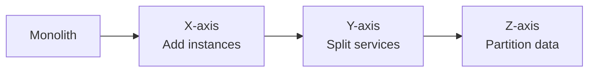
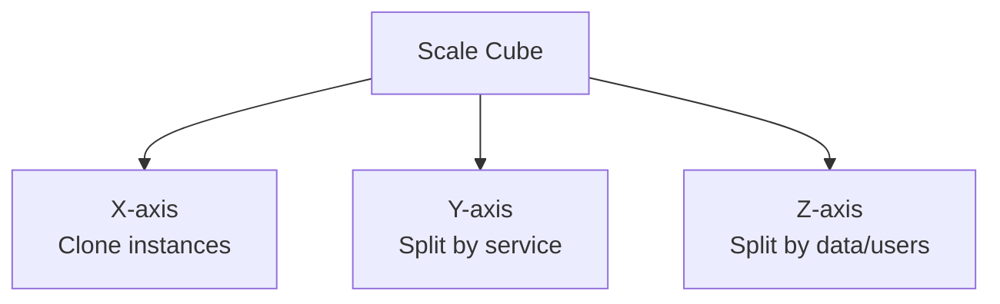
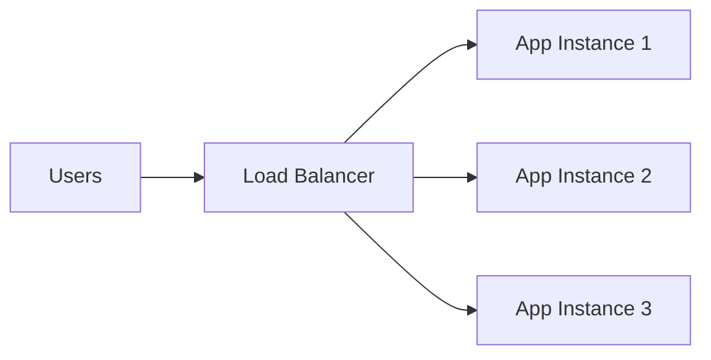
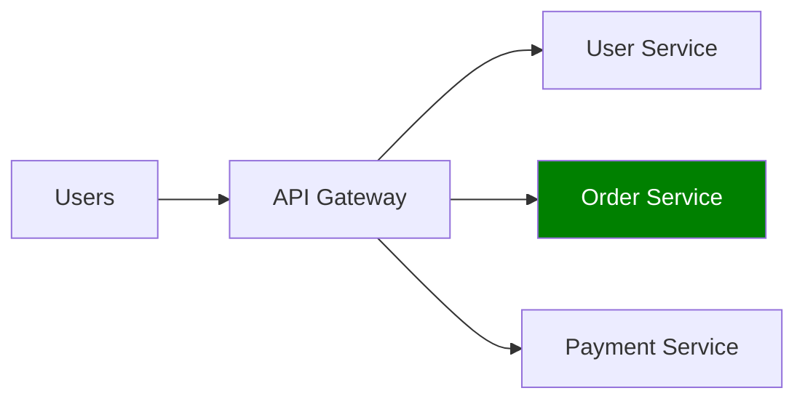
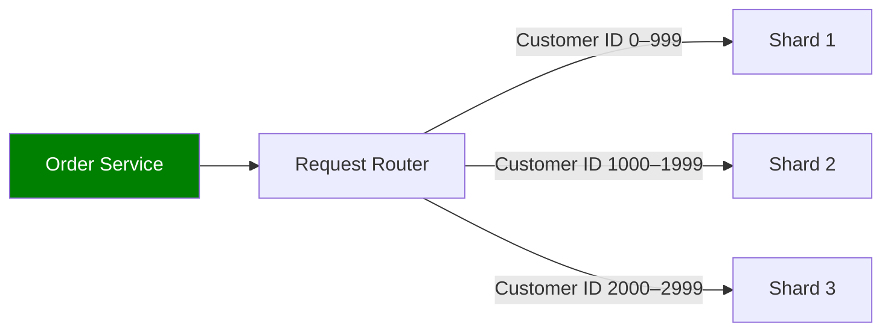

# Core building: Scale Cube 🧊
- https://www.youtube.com/watch?v=q1RUnL4xTds
- https://academy.bytemonk.io/products/system-design-mastery-beta/categories/2158360644/posts/2190592667
---
## Overview

| Axis       | Scaling method           | Meaning                                      | Example                                          |
| ---------- | ------------------------ | -------------------------------------------- | ------------------------------------------------ |
| **X-axis** | Horizontal duplication   | Run multiple identical application instances | Multiple Spring Boot pods behind a load balancer |
| **Y-axis** | Functional decomposition | Split the application by business capability | User, Order and Payment microservices            |
| **Z-axis** | Data partitioning        | Split users or data across instances         | Sharding customers by customer ID or region      |

---
## X-axis: Clone the application
- Best for: increasing request-processing capacity.
- Requirement: application instances should normally **be stateless.**
- Trade-off: the **shared database** may become the next bottleneck.

---
## Y-axis: Split by functionality
- Break a monolith into independently scalable services.
- Best for: scaling and deploying **different business capabilities** independently.
- Trade-off: 
  - introduces **distributed-system complexity**, 
  - networking challenges 
  - data consistency challenges.
  

---
## Z-axis : Split by data

