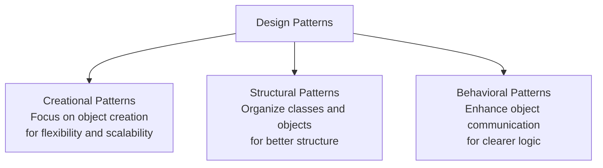

## 1. SOLID principles
- https://youtube.com/watch?v=5999cgzA95A (skip)

| Principle                     | Meaning                                        | System-design interpretation                                                |
| ----------------------------- | ---------------------------------------------- | --------------------------------------------------------------------------- |
| **S — Single Responsibility** | One component should have one reason to change | Split system by clear business responsibility                               |
| **O — Open/Closed**           | Open for extension, closed for modification    | Add new behavior without constantly changing existing services              |
| **L — Liskov Substitution**   | Implementations should be safely replaceable   | Swap implementations without breaking consumers                             |
| **I — Interface Segregation** | Prefer small focused interfaces                | Avoid huge APIs/contracts forcing clients to depend on unused operations    |
| **D — Dependency Inversion**  | Depend on abstractions, not implementations    | Services depend on contracts/interfaces rather than specific infrastructure |

## 2. Design pattern (23)
- https://youtube.com/watch?v=7qUVUFE4_Sc
- reusable sol to recurring problem

| Creational          | Structural   | Behavioral                 |
| ------------------- | ------------ | -------------------------- |
| 1. Abstract Factory | 1. Adapter   | 1. Chain of Responsibility |
| 2. Builder          | 2. Bridge    | 2. Command                 |
| 3. Factory Method   | 3. Composite | 3. Interpreter             |
| 4. Prototype        | 4. Decorator | 4. Iterator                |
| 5. Singleton        | 5. Facade    | 5. Mediator                |
|                     | 6. Flyweight | 6. Memento                 |
|                     | 7. Proxy     | 7. Observer                |
|                     |              | 8. State                   |
|                     |              | 9. Strategy                |
|                     |              | 10. Template Method        |
|                     |              | 11. Visitor                |

**Observe them in framework and libraries**

| Pattern                    | Where you commonly see it                            |
| -------------------------- | ---------------------------------------------------- |
| Factory / Abstract Factory | Spring Bean creation, DI containers                  |
| Singleton                  | Spring default bean scope                            |
| Proxy                      | Spring AOP, `@Transactional`, security, lazy loading |
| Decorator                  | Java I/O streams, middleware, filters                |
| Adapter                    | Spring MVC adapters, external API wrappers           |
| Facade                     | Service layer hiding multiple subsystems             |
| Observer                   | React state updates, event listeners, Angular RxJS   |
| Strategy                   | Spring Security strategies, pluggable algorithms     |
| Template Method            | Spring templates like `JdbcTemplate`                 |
| Chain of Responsibility    | Servlet filters, Spring Security filter chain        |
| Command                    | messaging, job processing, CQRS                      |
| Composite                  | UI trees, DOM, component hierarchies                 |

