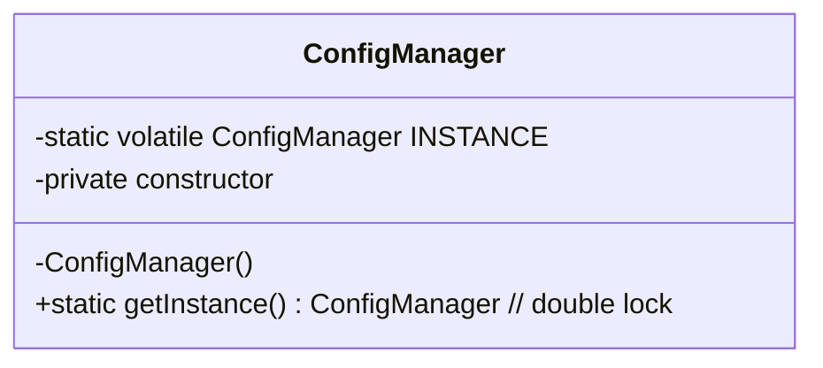
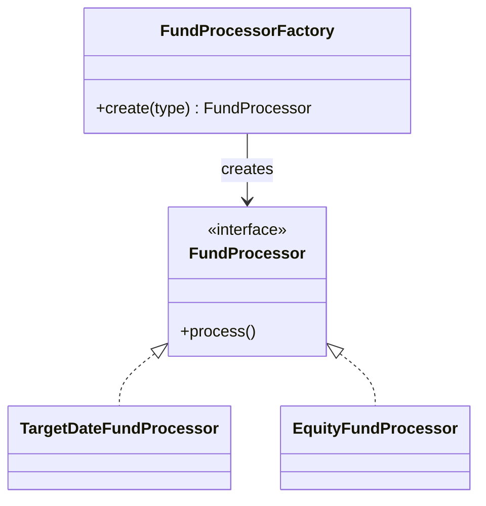

# Creational Patterns 
- Object creation done right
- Used when how objects are created matters.

## 1. Singleton 
- one shared instance
- Singleton can become problematic if it holds mutable shared state

```
Configuration manager
Application cache
Shared service bean
Connection/resource manager
```


## 2. Factory Method 
> In Spring Boot, the IoC container performs a lot of object creation for you, so you often use the idea without manually writing factories.
- create objects without exposing the exact creation logic to the caller

```java
class FundProcessorFactory {

    public FundProcessor create(String type) {

        return switch (type) {
            case "TDF" -> new TargetDateFundProcessor();
            case "EQUITY" -> new EquityFundProcessor();
            default -> throw new IllegalArgumentException();
        };
    }
}

// FundProcessor processor = factory.create("TDF");

```

## 3. Abstract Factory
- Factory of factories
- Creates a family of related objects

## 4. Builder 
- Construct complex objects step-by-step
- `lombok`

## 5. Prototype 
- Purpose: create a new object by copying/cloning an existing object instead of building it from scratch.

```java
public class FundConfig implements Cloneable {

    private String fundName;
    private String riskModel;
    private String allocationModel;

    @Override
    public FundConfig clone() {
        try {
            return (FundConfig) super.clone();
        } catch (CloneNotSupportedException e) {
            throw new RuntimeException(e);
        }
    }
}
//FundConfig tdf2045 = baseConfig.clone();
//FundConfig tdf2050 = baseConfig.clone();

// super.clone() does a shallow copy 👈
```

Examples:
- complex configuration objects
- report templates
- workflow definitions
- game objects / UI components