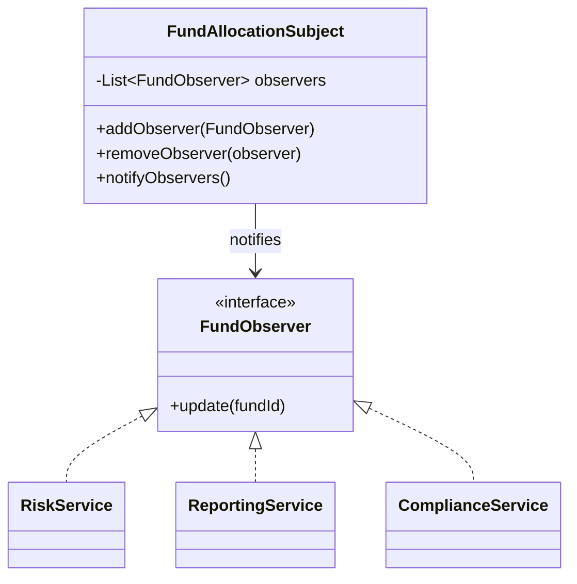
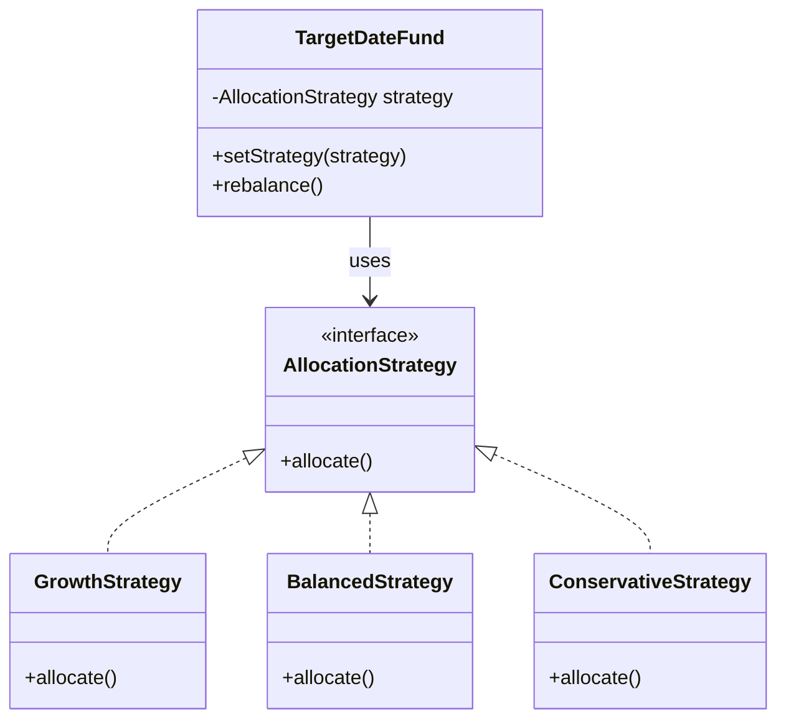

# Behavioral Patterns (Communication & responsibility)
- Used when objects need to talk to each other sanely.
- https://youtube.com/watch?v=NP7RmrHn1Q0

---
## 1. Observer  ⭐
- Publish/subscribe model
- Purpose: when one object changes, automatically notify many interested objects.
- **subject --> observers**
- backbone of event-driven, UI frameworks, etc


---
## 2. Strategy
- Swap algorithms at runtime
- Purpose: define multiple interchangeable algorithms behind the same interface, then choose one at runtime.


---
## Command ✔️
- https://youtu.be/USLwIwyWVIM bm
- behavioral design pattern that encapsulates a **request or action** as an object.
- Analogy/situation: re-mappable remote to different device. 👈🏻
- **component**:
    - **command** interface :: execute()
        - concrete command 1 ::  execute(){...}
        - concrete command 2 ::  execute(){...}
    - **receiver**  class - contains the **actual business logic**.
        - b1(){...}
        - b2(){...}
    - **invoker** class - invokes the command
        - remoteControl (with re-mappable buttons)

```java
// Command interface
interface Command {    void execute();}

// Receiver class - contains the actual business logic
class Light {
    public void turnOn() {        System.out.println("Light is ON");    }
    public void turnOff() {        System.out.println("Light is OFF");    }
}

// Concrete Command to turn on the light
class TurnOnCommand implements Command {
    private Light light;
    public TurnOnCommand(Light light) {        this.light = light;    }
    public void execute() {        light.turnOn();    }
}

// Concrete Command to turn off the light
class TurnOffCommand implements Command {
    private Light light;
    public TurnOffCommand(Light light) {        this.light = light;    }
    public void execute() {        light.turnOff();    }
}

// Invoker class - invokes the command
class RemoteControl {
    private Command command;
    public void setCommand(Command command) {        this.command = command;    }
    public void pressButton() {        command.execute();    }
}

// Client - sets up objects and commands
public class CommandPatternDemo {
    public static void main(String[] args) 
    {
        Light livingRoomLight = new Light(); // Receiver-1

        // 1️⃣ The client creates a command object and sets its receiver. 
        Command turnOn = new TurnOnCommand(livingRoomLight);
        Command turnOff = new TurnOffCommand(livingRoomLight);

        RemoteControl remote = new RemoteControl(); //Invoker

        // 2️⃣ client assigns the command to an invoker
        remote.setCommand(turnOn);        remote.pressButton(); //action-11
        remote.setCommand(turnOff);        remote.pressButton(); //action-2
    }
}

```

## Chain of Responsibility
- Request flows through handlers

##  Interpreter  
- Define grammar + interpret language

## Iterator  
- Traverse collections uniformly

## Mediator  
- Centralized communication hub

## Memento  
- Capture & restore state (undo/redo)


## State  
- Change behavior based on internal state


## Template Method  
- Algorithm skeleton with overridable steps

## Visitor  
- Add operations without changing object structure