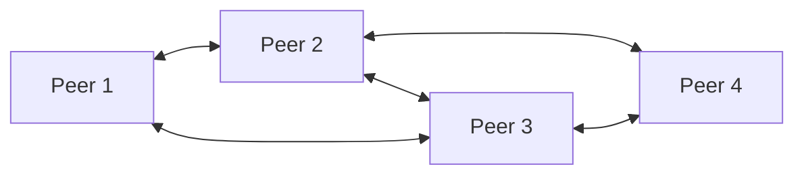
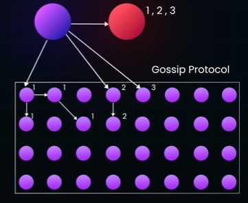
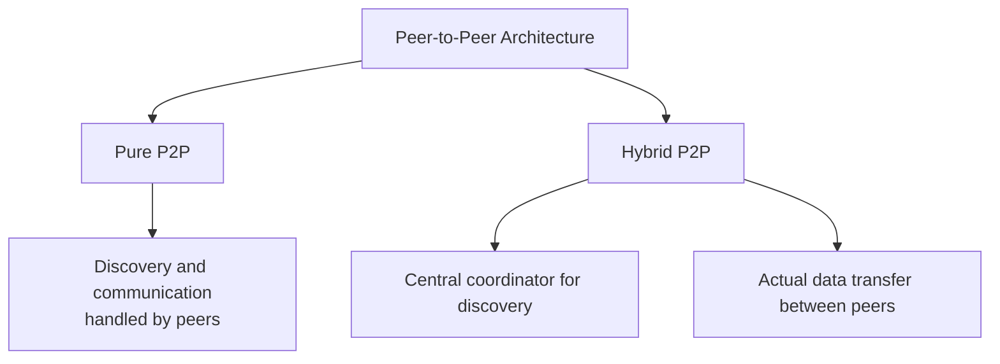
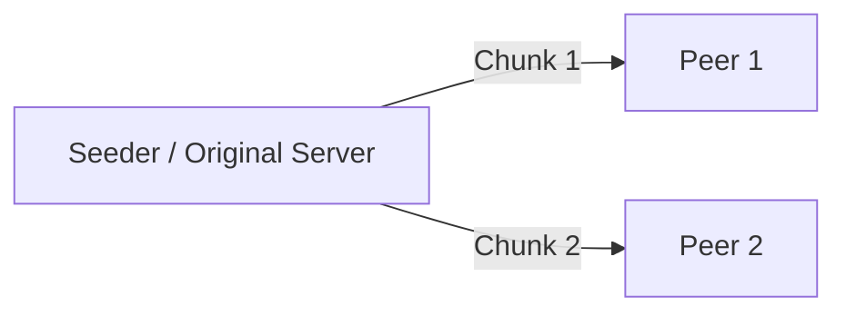
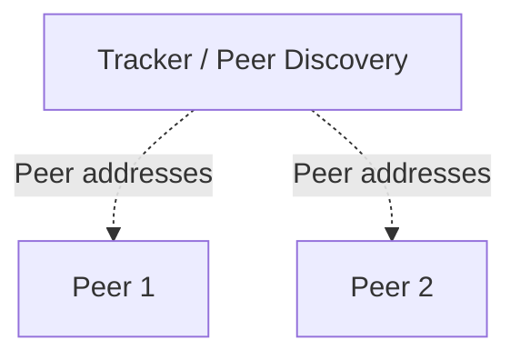
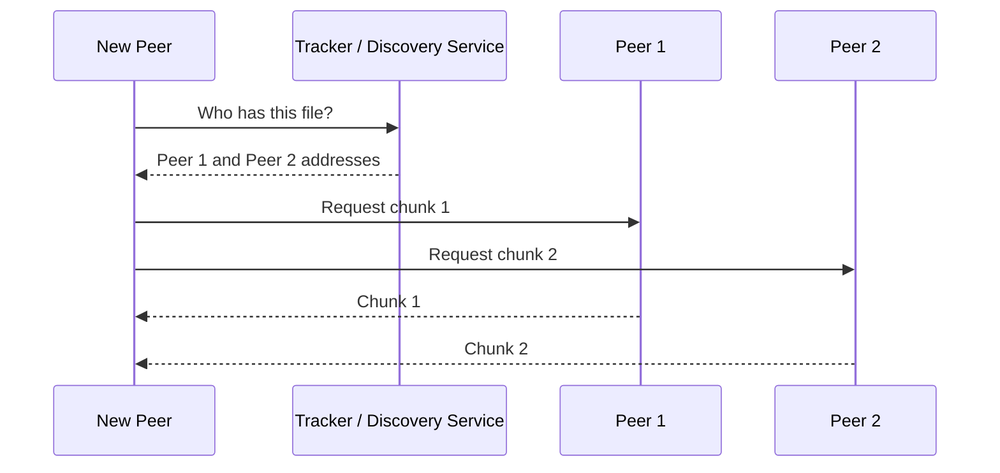
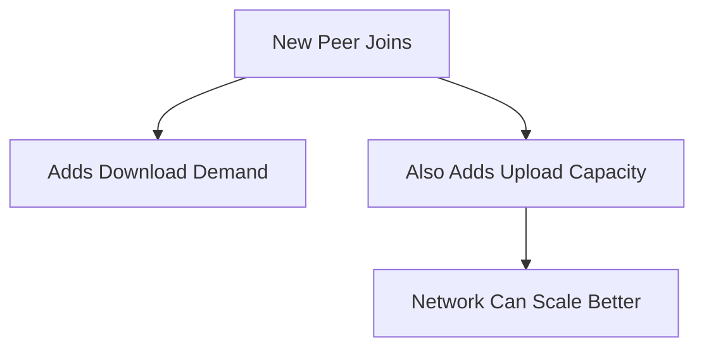

# p2p (peer to peer) Architecture
Reference
- https://www.youtube.com/watch?v=2v6KqRB7adg
- https://academy.bytemonk.io/products/system-design-mastery-beta/categories/2158360668/posts/2190592897

---
## Overview
- In peer-to-peer (P2P) architecture, every node can act as both:
  - Client — requests data or service
  - Server — provides data or service

| Centralized Architecture                      | Peer-to-Peer Architecture          |
| --------------------------------------------- | ---------------------------------- |
| Clients depend on a server                    | Peers communicate directly         |
| Server stores/control resources               | Resources distributed across peers |
| Easier governance and security                | Harder coordination and security   |
| Server may become bottleneck                  | Capacity grows as peers join       |
| Central server can be single point of failure | No single mandatory failure point  |

## Types

### 1. Pure
- **GOSSIP protocol**

| Property              | Meaning                                          |
| --------------------- | ------------------------------------------------ |
| Decentralized         | No central coordinator is required               |
| Eventually consistent | All nodes converge over time                     |
| Fault tolerant        | Failure of a few nodes does not stop propagation |

### 2. Hybrid P2P
- A **central service** helps peers discover each other, but peers exchange data directly.
- Examples:
  - Video/audio calling
  - Multiplayer games
  - BitTorrent with trackers
  - CDN, Content distribution, File sharing, Distributed storage

---
## Understand by example (large file-distribution)
> In P2P file distribution, the original server does not send the entire file
> separately to every user. It seeds chunks, and peers distribute those chunks among themselves.
1. **single server approach** (10 videos, 5GB each) - `15 min`
2. **sharding**, 5 server/shard (2 videos each, 5GB each) - `15/5 = 3 min`
3. **P2P solution** - `1 sec`
    - large file is split into small chunks and distributed among peers
    - These peers then communicate with each other in **parallel** to assemble the complete file

Each peer is now both:
- Client: downloads missing chunks
- Server: uploads available chunks

Scaling:

| Term        | Meaning                                        |
| ----------- | ---------------------------------------------- |
| **Seeder**  | Peer that has the complete file and uploads it |
| **Leecher** | Peer currently downloading the file            |
| **Peer**    | Node that can both download and upload         |
| **Swarm**   | All peers sharing the same file                |

