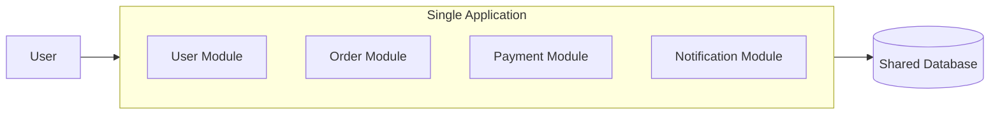

# Monolith Architecture
- [microservice-arch](01_core_02_microservice-arch.md)
---
## ✔️Overview
- The entire application runs as a **single deployable unit** or process.
- Modules such as users, orders, payments, and notifications are **packaged together.**
- Usually built using **one primary technology stack**.

---
## ✔️Important correction
> The problem is usually not the monolith itself.
> The problem is an unstructured monolith with tightly coupled modules

- A monolith is not automatically legacy, badly written, or expensive.
- A well-designed modular monolith can be:
  - simple and fast
  - cheap
  - easier to operate than microservices

---
## ✔️Limitations as the application grows
### Scaling
- Cannot easily scale one feature independently.
- The entire application must be scaled.
### Deployment
- Small changes may require redeploying the whole application.
- Releases may have a **larger blast radius.**
### Failure isolation
- A serious failure in one module can affect the entire process.
### Technology flexibility
- Harder to introduce different technologies for individual modules.
### Development
- Large codebases can become harder to understand and maintain.
- Multiple teams may create coordination bottlenecks.
### Resource efficiency
- Scaling the whole application for one busy module can waste resources.

---
## ✔️Migrate from Monolithic to Microservice 
- **strangler pattern** : https://youtu.be/DpuQ3-7e-rY?si=zYsggXjtUcNsh-jz
- modernize monolith business applications / Distributed software.
- Not all monolithic app is good candidate.
- complex and risky, due to its tightly coupled components and dependencies.
- not smooth, has to survive below challenges:
    - `Refactoring phase` : break down into modules
    - `application resiliency` as whole.
    - `Choosing runtimes` on cloud :
        - underlying OS, hardware, library, runtime env for each MS. there might be conflict.
        - running well on one hardware/runtine , but not working same on other.
        - Solution:` Application containers`:
            - encapsulated `lightweight` runtime environments.
            - promised `consistent` software environments.
            - each MS/module running in their own execution environments `isolated` from one another.

