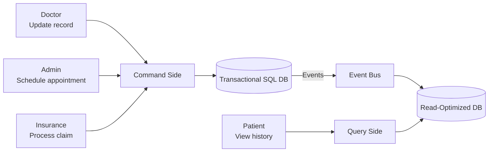
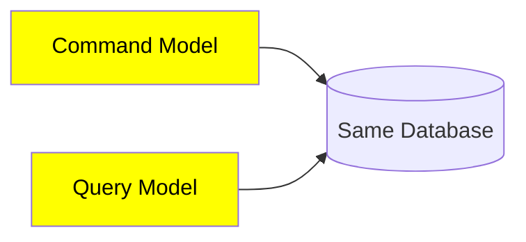
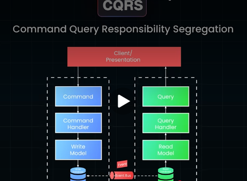
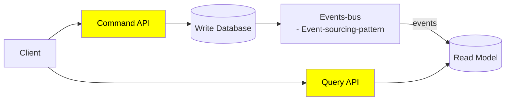
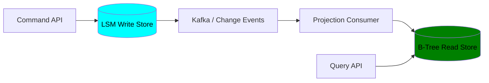

# CQRS vs CRUD
- https://academy.bytemonk.io/products/system-design-mastery-beta/categories/2158360668/posts/2192532488
---
## Overview
> Different model for read and write and single database cant handle both

Use it when:
- Reads and writes have very different scaling needs
- Read queries require heavy joins
- Domain rules are complex
- Different databases suit reads and writes
- Event-driven architecture already exists
  - Events must handle retries, ordering, and duplicates

Avoid it for simple CRUD systems because it adds :
- synchronization, 
- **eventual consistency,** 👈
- and operational complexity.

---
## Simple CQRS  

## Pure CQRS

---
## Example:

