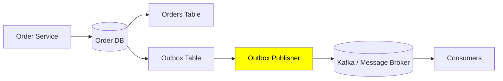

# transactional Outbox pattern
- https://youtube.com/watch?v=ms0qYCWJmfc

---
## overview
when a service must update its database and publish an event reliably without a distributed transaction.

```
1. Update Order DB ✅
2. Publish OrderCreated event ❌ fails

Result:
Database changed, but event was never published.
```

**Solution:**

Write both the business data and the event into the same database transaction.


```
BEGIN TRANSACTION

1. Insert/Update Order
2. Insert OrderCreated into Outbox table

COMMIT
---

Then asynchronously:

    Outbox Publisher
        ↓
    reads unsent events
        ↓
    publishes to Kafka
        ↓
    marks event as sent
```