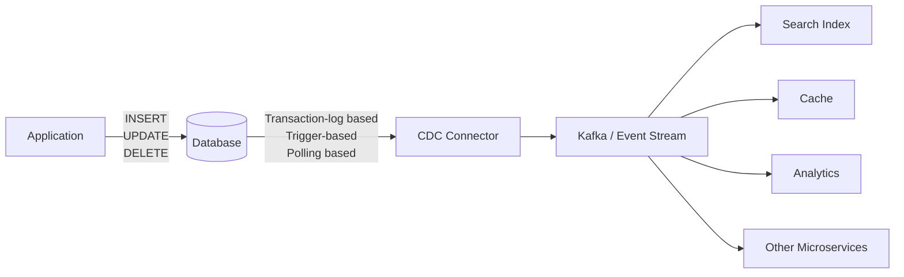

# Change Data Capture (CDC)

## Overview
CDC means detecting database changes—INSERT, UPDATE, DELETE—and publishing those changes so other systems can react.



```
App updates DB
   ↓
Database transaction commits
   ↓
CDC reads transaction log
   ↓
Change event published
   ↓
Consumers process event
```

| Method                    | Idea                                | Notes                           |
| ------------------------- | ----------------------------------- | ------------------------------- |
| **Transaction-log based** | Read DB WAL/binlog                  | ✅ Preferred                     |
| Trigger-based             | DB trigger writes changes somewhere | Adds DB overhead                |
| Polling                   | Periodically query changed rows     | Simple but slower/less reliable |
