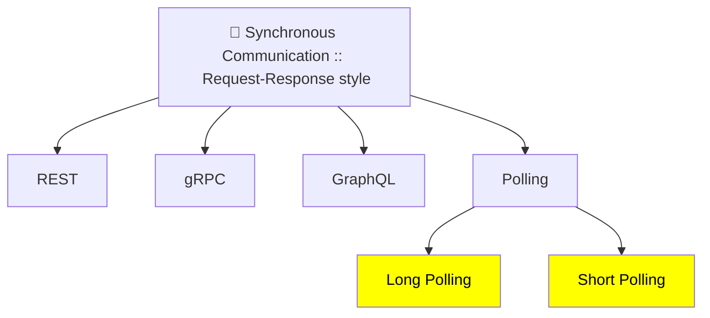
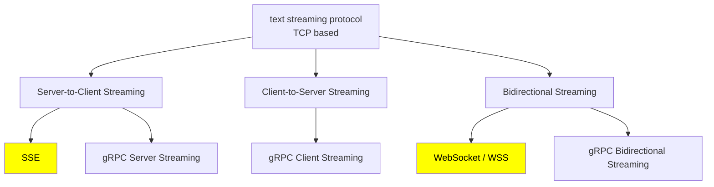
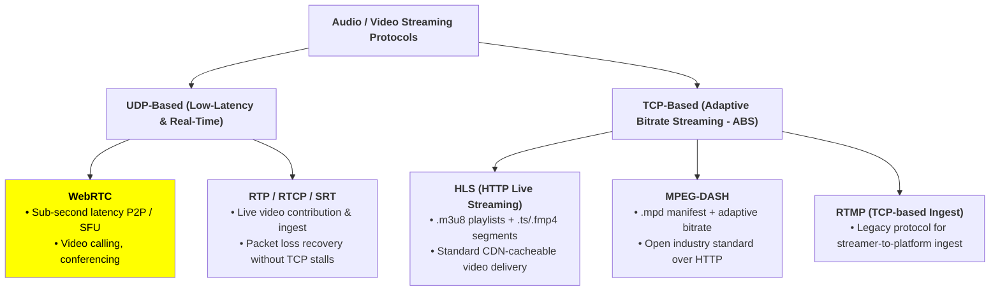
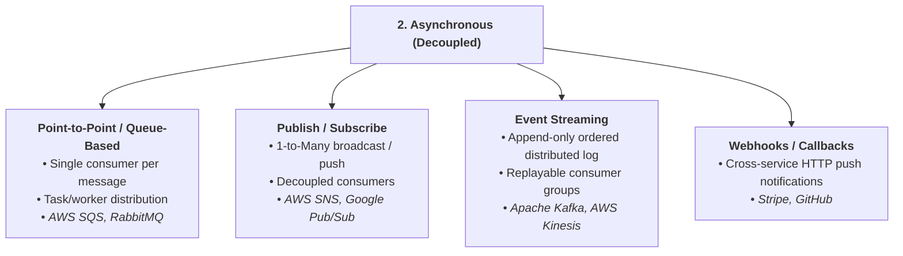
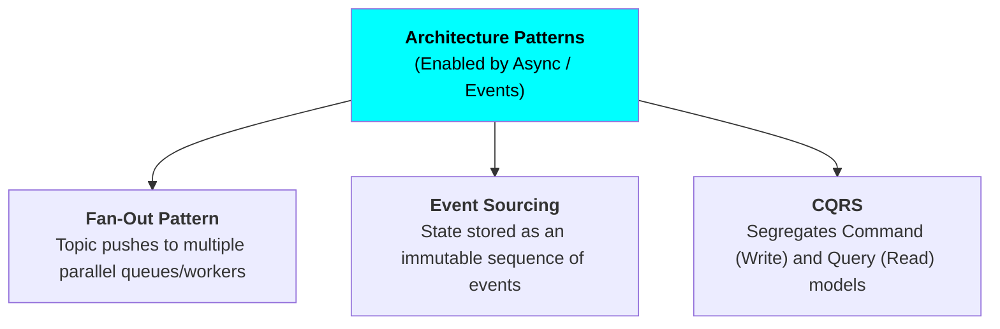

# IPC| Inter process Communication
- https://youtu.be/AMNWLz_f6qM?si=T076QSntCR53atIb | bm
- [01_01_request-response.md](01_01_request-response.md)
- [01_02_polling.md](01_02_polling.md)
- [02_01_streaming-TCP-based.md](02_01_streaming-sse.md)
- [02_02_streaming-wss.md](02_02_streaming-wss.md)
- [02_03_streaming-webRTC.md](02_03_streaming-webRTC.md)
- [02_04_Streaming-ABS.md](02_04_Streaming-ABS.md) 🔺
- [02_05_streaming-gRPC-based.md](02_05_streaming-gRPC-based.md) 🔺
- [03_01_event-driven.md](03_01_event-driven.md)
- [03_02_message-driven.md](03_02_message-driven.md)
- [05_batch_file_based.md](05_batch_file_based.md)

---
## IPC format:
- text based: `JSON`, `XML`
- binary: `Protobuf`, `avro`

## technologies and transport

| Communication   | Common technology | Typical transport |
| --------------- | ----------------- | ----------------- |
| REST API        | HTTP              | TCP               |
| gRPC            | HTTP/2            | TCP               |
| WebSocket       | WebSocket         | TCP               |
| Kafka           | Kafka protocol    | TCP               |
| RabbitMQ        | AMQP              | TCP               |
| SSE             | HTTP              | TCP               |
| WebRTC          | RTP/UDP           | `UDP`               |
| QUIC / HTTP/3   | QUIC              | `UDP`               |
| Video streaming | HLS/DASH          | Usually TCP       |
| Real-time video | WebRTC/RTP        | Usually `UDP`       |


---
## Overview

```
IPC (Inter-Process Communication)
│
├── 1. Synchronous (Request / Response)
│      ├── REST / HTTP (JSON / XML)
│      ├── gRPC (Protobuf / HTTP/2)
│      ├── GraphQL
│      ├── Polling
│           ├── short Polling
│           ├── Long Polling
│
├── 2. Asynchronous (Decoupled)
│   ├── Point-to-Point / Queue-based (e.g., AWS SQS, RabbitMQ)
│   ├── Pub/Sub (e.g., AWS SNS, Google Cloud Pub/Sub)
│   ├── Event Streaming (e.g., Apache Kafka, AWS Kinesis)
│   ├── Webhooks / HTTP Callbacks (e.g., Stripe, GitHub)
│   └── Architecture Patterns (Enabled by Async/Events)
│       ├── Fan-Out Pattern
│       ├── Event Sourcing
│       └── CQRS (Command Query Responsibility Segregation)
│
├── 3. Streaming Protocols
│   ├── TCP-based
│   │   ├── WebSockets (Bidirectional full-duplex)
│   │   ├── Server-Sent Events (SSE - Unidirectional push)
│   │   └── gRPC Streaming
│   └── UDP-based
│       ├── QUIC / HTTP/3
│       └── WebRTC / RTP (Real-time audio/video)
│
├── 4. Batch & Storage-Mediated
│   ├── Object Storage (AWS S3, GCS)
│   ├── File Transfer (SFTP, NFS, SMB)
│   └── Database CDC Pipelines (Change Data Capture)

```

---
## ✔️Synchronous (Request/Response)


---
## ✔️Streaming :: Text




## ✔️Streaming :: Audio/Video 



---
## ✔️Asynchronous (Decoupled)







