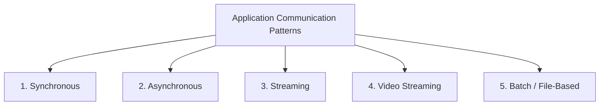
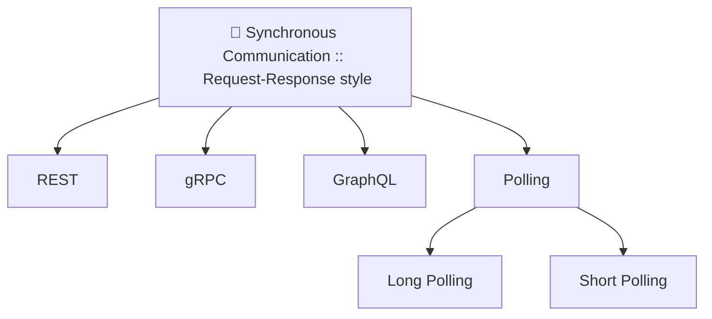
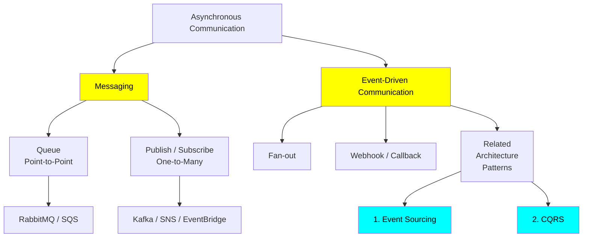
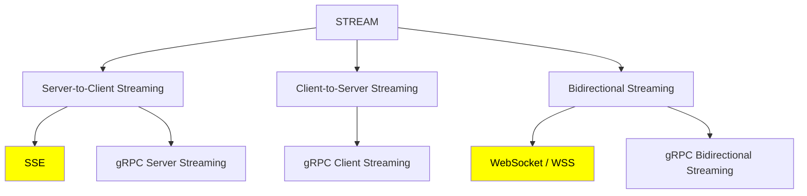

# IPC| Inter process Communication
- https://youtu.be/AMNWLz_f6qM?si=T076QSntCR53atIb | bm
- [01_01_request-response.md](01_01_request-response.md)
- [01_02_polling.md](01_02_polling.md)
- [02_01_event-driven.md](02_01_event-driven.md)
- [02_02_message-driven.md](02_02_message-driven.md)
- [03_streaming-TCP-based.md](03_streaming-TCP-based.md)
- [04_video-streaming.md](04_video-streaming.md)
- [05_batch_file_based.md](05_batch_file_based.md)

---
## IPC format:
- text based: `JSON`, `XML`
- binary: `Protobuf`, `avro`

---
## Overview

| Category        |         Caller waits? | Connection                           | Common examples                  |
|-----------------| --------------------: | ------------------------------------ |----------------------------------|
| Synchronous     |                   Yes | Usually short-lived                  | REST, HTTP, unary gRPC , polling |
| Asynchronous    |                    No | Decoupled through broker or callback | Kafka, RabbitMQ, SQS, webhook    |
| Streaming       |            Continuous | Long-lived                           | WebSocket, SSE, gRPC streaming   |
| video Streaming |            Continuous | Long-lived                           | WebRTC                           |
| Batch           | No real-time response | Periodic or file-based               | SFTP, S3 files, Spark, MapReduce |

---
## A. Synchronous: Request/Response 
### HTTP-based

---
## B. Asynchronous Communication
### Event based 
- fanOut, 
- webhook, 
- event sourcing/CQRS

### Message based 
- point-2-point 
- pub/Sub

---
## C. Streaming
### TCP based

## D. Video Streaming
### UDP based
- webRTC
- ABS

## Batch/File-based
- FTP
- object: AWS S3
- ...