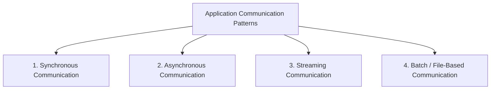

# IPC| Inter process Communication
- https://youtu.be/AMNWLz_f6qM?si=T076QSntCR53atIb | bm

---
## IPC format:
- text based: `JSON`, `XML`
- binary: `Protobuf`, `avro`

---
## Overview

| Category     |         Caller waits? | Connection                           | Common examples                  |
| ------------ | --------------------: | ------------------------------------ | -------------------------------- |
| Synchronous  |                   Yes | Usually short-lived                  | REST, HTTP, unary gRPC           |
| Asynchronous |                    No | Decoupled through broker or callback | Kafka, RabbitMQ, SQS, webhook    |
| Streaming    |            Continuous | Long-lived                           | WebSocket, SSE, gRPC streaming   |
| Batch        | No real-time response | Periodic or file-based               | SFTP, S3 files, Spark, MapReduce |

---
### [A. Synchronous: Request/Response](./01_synchronous.md)
- http  / tcp handshake
- https / tls handshake
- grpc (http2.0)
- graphQL (http)

### [B. Asynchronous Communication](./02_asynchronous.md)
- event based - fanOut, webhook, event sourcing/CQRS
- message based - p2p, pubSub
- polling - short / long

### [C. Streaming - TCP based](./03_streaming-TCP-based.md)
- ws / wss
- gRPC stream

### [D. Video Streaming - UDP based](03_video-streaming.md)
- webRTC
- Video stream

### [Batch/File-based](./04_batch_file_based.md)
- FTP
- object: AWS S3
- ...