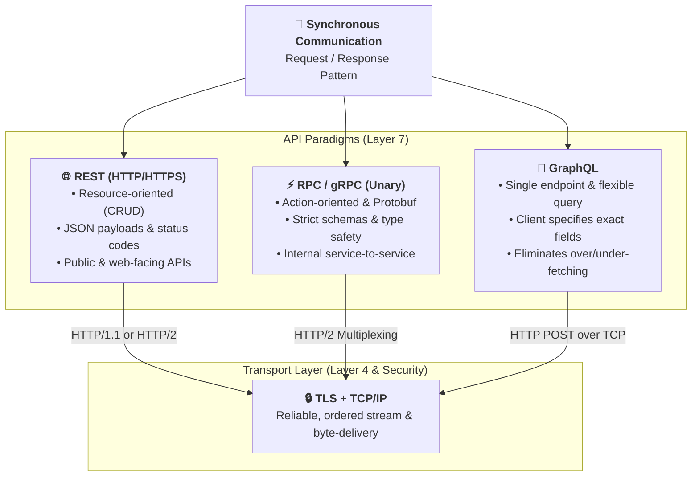

# Synchronous :: request/response style

--- 
## HTTP based

---
### 1. REST
- [01_rest_01_overview.md](../../SD_08_API-Design/02_protocol/01_rest_01_overview.md)

---
### 2. RPC / GRPC
- [02_grpc_01_overview.md](../../SD_08_API-Design/02_protocol/02_grpc_01_overview.md)

---
### 3. graphQL
- [03_graphQL_01_overview.md](../../SD_08_API-Design/02_protocol/03_graphQL_01_overview.md)

---
## More links
- [SD_08_API-Design](../../SD_08_API-Design)
- [SD_21_microservice](../../SD_21_microservice)
- [02_pattern_10_service-mesh.md](../04_architecture/02_pattern_10_service-mesh.md)
