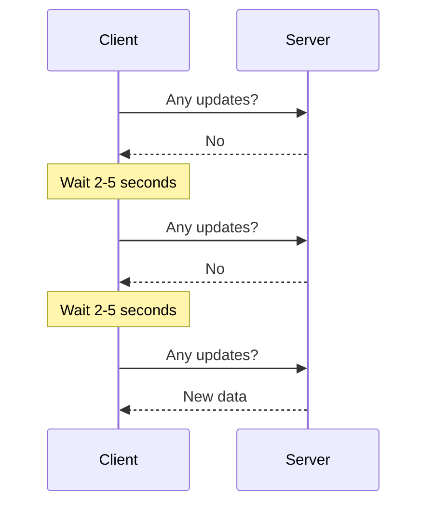
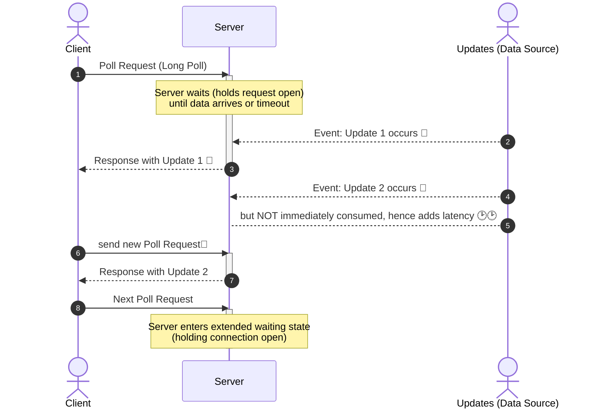
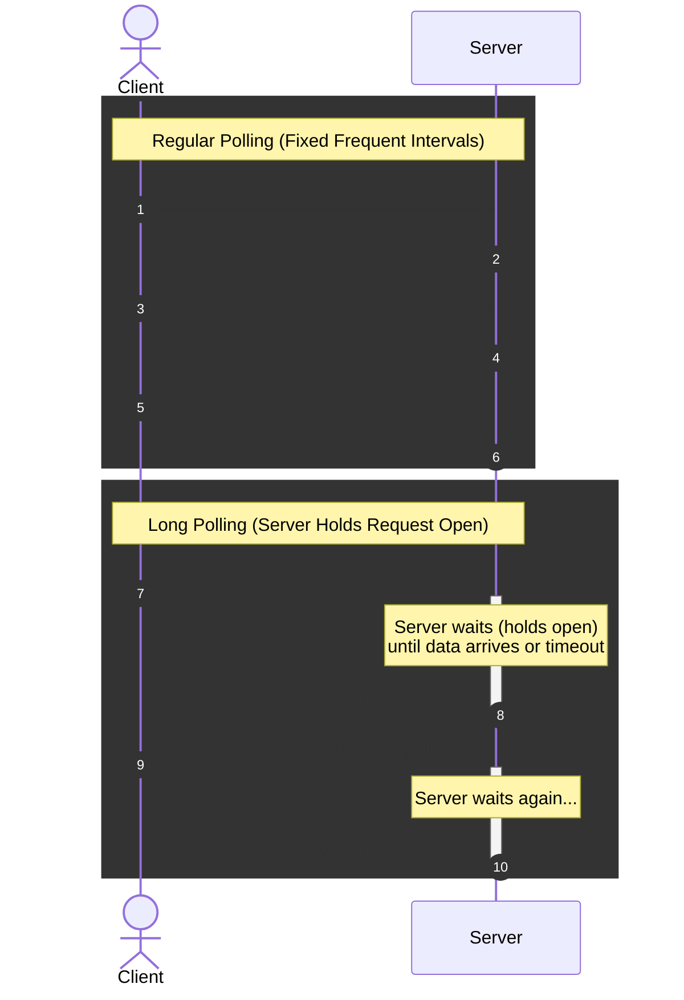

#  synchronous Communication :: Polling
- https://www.youtube.com/watch?v=pnj3Jbho5Ck bm lp
- https://www.youtube.com/watch?v=b4qyOpGg748 bm sp
- https://www.hellointerview.com/learn/system-design/patterns/realtime-updates#long-polling-the-easy-solution | check 

---
## Short Polling
### Overview
- client repeatedly requests data from a server **at set intervals** 
- using any network protocol.eg: https, etc




**sample code**

```javascript
async function poll() {
  const response = await fetch('/api/updates');
  const data = await response.json();
  processData(data);
}

// Poll every 2 seconds
setInterval(poll, 2000);
```

### pros
```
- Simple to implement.  
- Stateless. 
- No special infrastructure needed.  
- Works with any standard networking infrastructure.  
``` 
### cons
```
- Limited update frequency.
  - reducing the polling interval, significantly increases the load on the server
- More bandwidth usage.
- Can be resource-intensive with many clients, establishing new connections, etc.

```
### When to use ⭐
- great baseline solution
- **short window updates** 

> not ideal for real-time applications like chat
> - Temperature Monitoring
> - AJAX application polls bts

### interview
- take advantage of **HTTP keep-alive** connections, if latency is problem 👈
- No xtra infrastructure,  still need to be specific about the **polling frequency**

---
## Long Polling
### Overview
> Long polling = normal HTTP request + server intentionally delays the response.
- A variation where the server **holds the client's request** `hanging GET (with timeout)` 
- until data is available **or** a timeout occurs
  - This allows the server to "push" information, 
  - but clients still need to reconnect periodically after timeouts

**sample client side code**

```javascript
// Client-side of long polling
async function longPoll() {
  while (true) {
    try {
      const response = await fetch('/api/updates');
      const data = await response.json();
      
      // Handle data
      processData(data);
    } catch (error) {
      // Handle error
      console.error(error);
      
      // Add small delay before retrying on error
      await new Promise(resolve => setTimeout(resolve, 1000));
    }
  }
}
```



### pros and cons
- similar to short polling

| **Advantages**                                                                         | **Disadvantages**                                                                                                                   |
| -------------------------------------------------------------------------------------- |-------------------------------------------------------------------------------------------------------------------------------------|
| Builds on **standard HTTP** and works with HTTP-compatible clients and infrastructure. | 🔺**Higher latency** than persistent push mechanisms such as WebSockets or SSE.                                                       |
| **Easy to implement** compared with WebSockets.                                        | **HTTP overhead** because a new request is made after every response/timeout.                                                       |
| No special protocol or infrastructure required.                                        | Can become **resource-intensive at scale** because many requests remain open simultaneously.                                        |
| Can work with a **stateless application model** across requests.                       | Not ideal for **frequent updates** because of repeated request/response cycles.                                                     |
| Works well with existing **HTTP proxies, load balancers, and firewalls**.              | 🔺**Monitoring is harder** because requests can remain open for long periods.                                                       |
| —                                                                                      | 🔺**Browser connection limits** can restrict how many simultaneous long-polling connections a client can maintain to the same origin. |
| —                                                                                      | Although the application can be stateless, the server/LB still needs resources for each **outstanding connection**.                 |

### Long polling with a load balancer

```
Request 1
Client → LB → Server 1
              │
              └── waiting for new data


Request 2
Client → LB → Server 2
              │
              └── doesn't know about Server 1's waiting request
```
```
✔️A better architecture is usually:

                ┌──► Server 1  ──┐
                │                │
Client → LB ────┼──► Server 2  ──┼──► Shared Event Store⭐
                │                │       / Pub/Sub 
                └──► Server 3  ──┘
```

### when to use ⭐
- great solution for **near real-time updates** with a simple implementation
- when updates are infrequent
- latency is not issue

> - Great solution for applications where a **long async process** is running but you want to know when it finishes, as soon as it finishes.
> - **payment processing.** :  We'll long-poll for the payment status before showing the user a success page.

### interview
- take advantage of **HTTP keep-alive** connections, if latency is problem 👈
- No xtra infrastructure,  still need to be specific about the **polling frequency**
    - eg: you don't want your **load balancer hanging** up on the client after` 60 seconds`
    - `15-30s` is a pretty common polling interval

---
## Compare: long vs short polling




