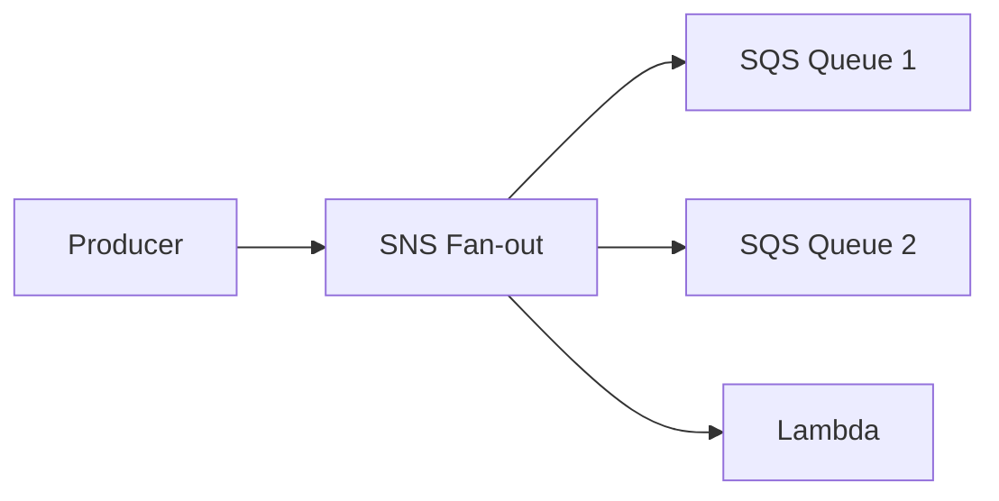
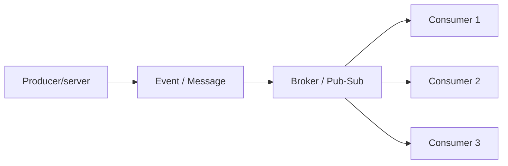
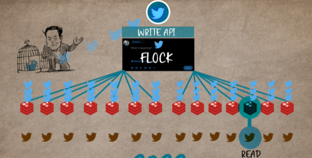
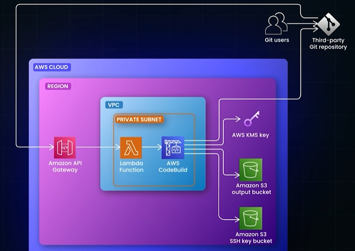

#  Asynchronous Communication : Event Driven
## reference
- [⭐event-driven architecture](../04_architecture/02_pattern_06_event-driven.md)

---
## 1. Fan-out 
| Concept               | Meaning                                                                                       |
| --------------------- | --------------------------------------------------------------------------------------------- |
| **Fan-out**           | A delivery pattern: one message is copied to multiple destinations                            |
| **Publish–Subscribe** | A messaging model: publishers send to a topic, and subscribers independently receive messages |

They look similar because pub-sub usually implements fan-out

fan-out-1:



fan-out-2: implemented with pub-sub:


Twitter 2012-2013 problem : https://www.youtube.com/watch?v=FEkXjNFrL1o
```
Twitter had 150 million users 
 handled write - 6,000 tweets per second. 
 Challenge-1:
  - read requests: 300,000 requests per second to serve homepages
    - User timeline 
    - Home timeline
  - Fix-1: Adding indices speeds up reads but slows down writes.
           Since reads are more frequent than writes, this is a fair trade-off.
           
  - Fix-2: 
    - pre-computed and stored user home timelines in a Redis cluster
    - Twitter serves the cached timeline from Redis, significantly reducing latency
    - When a user tweets, the tweet is replicated into the home timeline queue of each follower, 
    - resulting in thousands of writes to redis, for a single tweet
    - this is fanOut 👈🏻
  
```


---
## 2. Webhook / callback
- just **Http Post** with event data.
- https://www.youtube.com/watch?v=oQaJn6RdA3
- traditional: polling, long-live connection
    - eating resources
- Webhooks allow servers
    - to notify client applications
    - only when new events occur, rather than requiring clients to check periodically.
- eg: gitHub make post call --> harness trigger (POST /api, idempotent), payload: {eventId...}
- benefit:
    - Webhooks improve system performance,
    - reduce latency,
    - and are crucial in modern microservices architectures for enabling system decoupling

**Example for CI/CD pipeline in AWS**
- https://youtu.be/9zfAqoTm4-Q?si=_PGo_F1tcNZvuxyi
- 

## 3. related Architecture Pattern
> Note: just arch pattern
- [event-sourcing](../04_architecture/02_pattern_11_event-sourcing.md)
- [CQRS](../04_architecture/02_pattern_07_CQRS.md)
