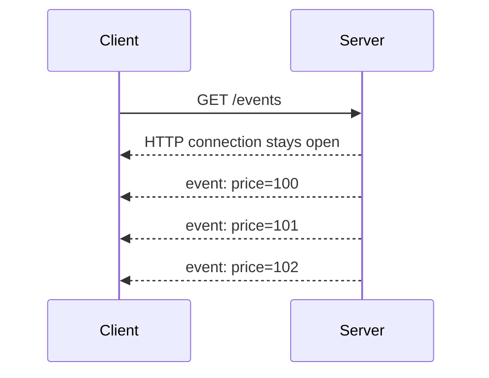

# Streaming (Http based) 
## Reference:
- [01_concept_01_socket.md](../../SD_04_network-essential/02_basic-concepts/01_concept_01_socket.md)⭐
- https://www.youtube.com/watch?v=pnj3Jbho5Ck | bm ws part-1 overview (2024) 
- https://www.youtube.com/watch?v=G0_e02DdH7I | bm ws part-2 details(2024) 
- https://www.youtube.com/watch?v=BKonNa7XPdg | bm ws part-3 more deep arch (2026) 
- https://www.hellointerview.com/learn/system-design/patterns/realtime-updates#long-polling-the-easy-solution | check

---
## Overview
> think of it : 
> - SSE is a nice hack on top of HTTP /  extension/upgrade to long-polling because it eliminates the issues around **high-frequency updates**
> - that allows a server to stream many messages/(chunks)/textual data, over time 
> - in a **single response** from the server
> - over a **single HTTP connection** /  long-lived HTTP connection through **socket**

- don't have a polling interval to negotiate or tune. 👈
- **won't be super-long-lived** (e.g. `30-60s` is pretty typical), 
- So consider how **clients re-establish connections** and how they deal with the gaps in between.
  - If a client loses its connection, it can **reconnect** and provide the `last event ID` it received.
  - The server can then use that ID to send all the events that occurred while the client was disconnected
- **http header** :  `Content-Length` vs `Transfer-Encoding: chunked`
- **Modern browsers have built-in support for SSE** through the `EventSource` object

```javascript
const eventSource = new EventSource('/api/updates');

eventSource.onmessage = (event) => {
  const data = JSON.parse(event.data);
  updateUI(data);
};

// Server-side (Node.js/Express example)
app.get('/api/updates', (req, res) => {
  res.setHeader('Content-Type', 'text/event-stream');
  res.setHeader('Cache-Control', 'no-cache');
  res.setHeader('Connection', 'keep-alive');

  const sendUpdate = (data) => {
    res.write(`data: ${JSON.stringify(data)}\n\n`);
  };

  // Send updates when data changes
  dataSource.on('update', sendUpdate);

  // Clean up on client disconnect
  req.on('close', () => {
    dataSource.off('update', sendUpdate);
  });
});
```


```
 ✔️HTTP APIs you'd get a single, cohesive JSON blob as a response from the server 
 that is processed once the whole thing has been received.
 
{
  "events": [
    { "id": 1, "timestamp": "2025-01-01T00:00:00Z", "description": "Event 1" },
    { "id": 2, "timestamp": "2025-01-01T00:00:01Z", "description": "Event 2" },
    ...
    { "id": 100, "timestamp": "2025-01-01T00:00:10Z", "description": "Event 100" }
  ]
}


✔️On the other hand, with SSE, the server can push many messages 
as "chunks" in a single response from the server:

data: {"id": 1, "timestamp": "2025-01-01T00:00:00Z", "description": "Event 1"}
data: {"id": 2, "timestamp": "2025-01-01T00:00:01Z", "description": "Event 2"}
...
data: {"id": 100, "timestamp": "2025-01-01T00:00:10Z", "description": "Event 100"}
```

## when to use ⭐ 
- situations where you want clients to get notifications or events as soon as they happen.
- A very popular use-case for SSE today is **AI chat apps, stream new tokens (words)** to the user as they are generated to keep the UI responsive

## pros

| **Advantage**                        | **Explanation**                                                                      |
|--------------------------------------| ------------------------------------------------------------------------------------ |
| **Built into browsers**  ✔️          | Uses the native `EventSource` API; no additional client library is required.         |
| **Automatic reconnection**   ✔️        | Browsers automatically attempt to reconnect if the connection drops.                 |
| **Works over HTTP**                  | Uses standard HTTP, making it easier to integrate with existing HTTP infrastructure. |
| **More efficient than long polling** | Keeps a persistent connection open instead of repeatedly creating HTTP requests.     |
| **Simple to implement**              | Straightforward model: client connects once, server continuously sends events.       |


## cons
> - Not ideal for very interactive apps: WebSockets are usually better for chat, multiplayer games, etc.
> - Need both **browsers** and **all infra between** the client and server to support streaming responses.
> - https://dev.to/miketalbot/server-sent-events-are-still-not-production-ready-after-a-decade-a-lesson-for-me-a-warning-for-you-2gie

| **Disadvantage**                                    | **Explanation**                                                                                                                                                                      |
|-----------------------------------------------------|--------------------------------------------------------------------------------------------------------------------------------------------------------------------------------------|
| **One-way communication** + Text-based              | Server → client only. The client needs separate HTTP requests to send data to the server.                                                                                            |
| **Proxy/networking issues**  🔺                     | Proxies/load balancers must be **configured** to avoid buffering or timeouts. Sometimes  may interfere with long-lived HTTP streaming connections, making issues difficult to debug. |
| **Browser connection limits**  🔺                   | Browsers may limit concurrent connections per origin, potentially restricting the number of SSE connections.                                                                         |
| **Long-lived connections complicate monitoring** 🔺 | Connections remain open for long periods, requiring careful handling of timeouts, connection counts, and load-balancer behavior.                                                     |
