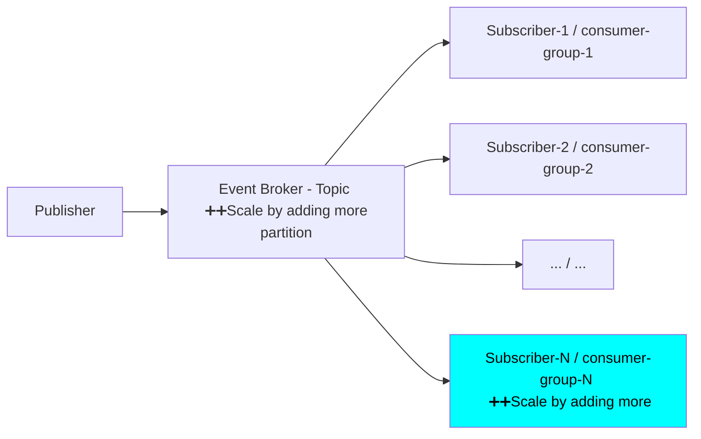
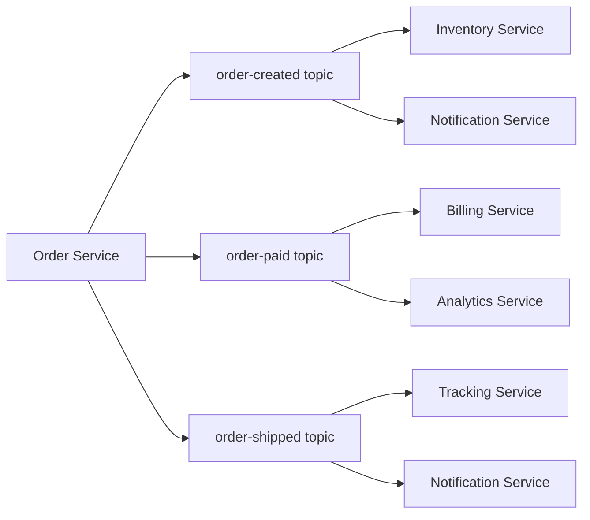
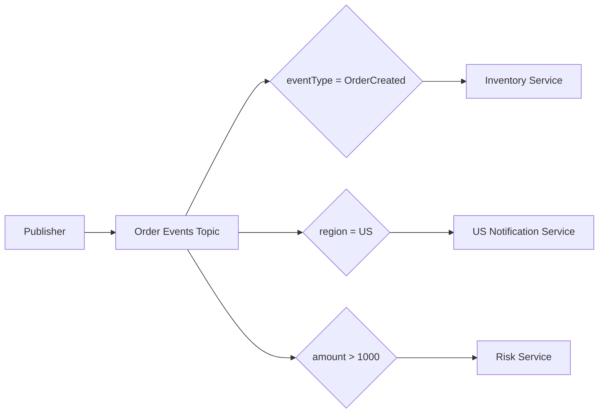

#  Asynchronous Communication : Messaging based

## Overview
| Channel Type          | Delivery                          | Best For                  | Interaction | Example                                            |
| --------------------- | --------------------------------- | ------------------------- | ----------- | -------------------------------------------------- |
| **Point-to-Point**    | One message → **one receiver**    | Command / task processing | One-to-One  | Job queue where one worker processes the task      |
| **Publish-Subscribe** | One message → **all subscribers** | Events / notifications    | One-to-Many | `OrderPlaced` → Billing + Inventory + Notification |

## point-2-point (Queue)
- AWS SQS
- rabit MQ

---
## pub-sub (Topic)
> Use Pub-Sub when one business event must trigger multiple independent downstream actions,
> without tightly coupling the producer to consumers.

- In event of network failure/partition, subscriber will leave and comeback and, need message again.
- that's why **at least once** delivery is required, (one or more times delivery),
    - hence keep idempotent consumer.
- Message/event are **ordered**.
- In **kafka** each topic is **distributed in nature (has partitions)**
- More:
    - separation of concern
    - content based filtering

**separation of concern** : create multiple topic

**content based filtering**: filter and then subscribe
