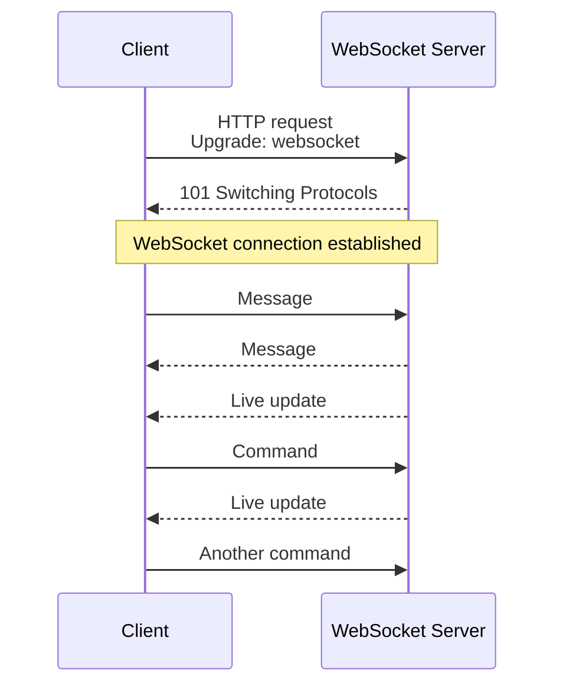
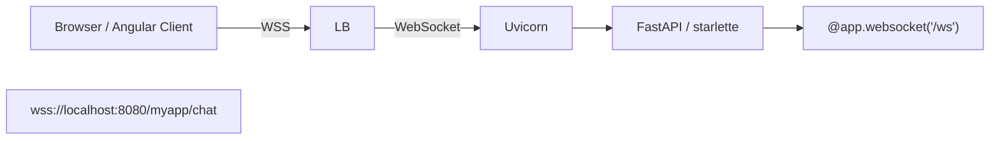
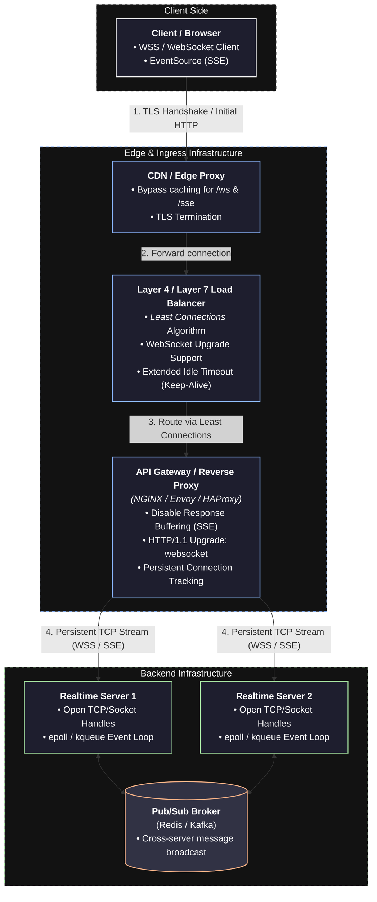

# Streaming (Http based) 
## Reference:
- [01_concept_01_socket.md](../../SD_04_network-essential/02_basic-concepts/01_concept_01_socket.md)⭐
- https://www.youtube.com/watch?v=pnj3Jbho5Ck | bm ws part-1 overview (2024) 
- https://www.youtube.com/watch?v=G0_e02DdH7I | bm ws part-2 details(2024) 
- https://www.youtube.com/watch?v=BKonNa7XPdg | bm ws part-3 more deep arch (2026) 
- https://www.hellointerview.com/learn/system-design/patterns/realtime-updates#long-polling-the-easy-solution | check

---
##  Overview
> ⚠️ Just because clients can upgrade from HTTP to WebSocket doesn't mean that the infrastructure will support it.
> Every piece of infrastructure between the client and server will need to support WebSocket connections.
> If you've ever implemented Websockets you've probably hit a bunch of issues with **firewalls, proxies, load balancers,
> and other infrastructure** that don't support WebSocket connections.

> WebSockets are powerful, but the infra required to support them can be expensive
> and the overhead of **stateful connections** (especially at scale) will require significant accommodations in your design.
> Hold off unless you really need them!

### overview 1
- the client opening a **long-lived connection** with the server, typically through a **socket** 👈
- allowing the server to **push** information **without a client request** and vice versa. 

```
Longlive Persistent/Stateful connection:
        
Client  ◄═══════════ infa Support ═══════════► WSS Server 
          send / receive
          send / receive
          send / receive
          
```

### overview 2
- WebSockets provide a persistent, TCP-style connection between client and server, 
- allowing for real-time, bidirectional communication with broad support (including browsers). 
- Unlike HTTP's request-response model, WebSockets enable servers to push data to clients without being prompted by a new request. 
- Similarly clients can push data back to the server without the same wait.
- WebSockets are initiated via an HTTP "upgrade" protocol, which allows an existing TCP connection to change L7 protocols.
- This is super convenient because it means you can utilize some of the existing HTTP session information (e.g. cookies, headers, etc.) to your advantage.

**Sample program**

```javaScript
// Client-side
const ws = new WebSocket('ws://api.example.com/socket');

ws.onmessage = (event) => {
  const data = JSON.parse(event.data);
  handleUpdate(data);
};

ws.onclose = () => {
  // Implement reconnection logic
  setTimeout(connectWebSocket, 1000);
};

// Server-side (Node.js/ws example)
const WebSocket = require('ws');
const wss = new WebSocket.Server({ port: 8080 });

wss.on('connection', (ws) => {
  ws.on('message', (message) => {
    // Handle incoming messages
    const data = JSON.parse(message);
    processMessage(data);
  });

  // Send updates to client
  dataSource.on('update', (data) => {
    ws.send(JSON.stringify(data));
  });
});
```

##  when to use ⭐
> when you need **high-frequency, persistent, bi-directional** communication between client and server.
- Stock trading websites displaying live price fluctuations 
- Chat applications
- Gaming applications that require automatic UI refreshes

##  connection upgrade
```
- Https/TCP handshake
- negotiate to upgrade, to WS with request header:
    - `Upgrade: websocket`,
    - `Connection: Upgrade`,
    - `Sec-WebSocket-Key: xxxxxxxx`
- server validates:
    - response code `101` / Switching L7 Protocols,
    - response header:
        - `Sec-WebSocket-Accept: zzzzzzzzz`,
        - which is generated by concatenating the client's key with a GUID
        - and applying SHA-1 hashing.
- establishes a persistent, **bi-directional connection**/ tunnel
- both client/server, can stream **data-frame**, uninterrupted 👈🏻
- either, initiate close connection
```






---
##  pros
- Full-duplex (read and write) communication.
- **Lower latency** 
- Efficient for **frequent** messages | high frequency
- Wide browser support

---
##  cons 
**Infra in between client and server must support persistent connection like wss and sse**
- L7 load balancers aren't guaranteeing
- L4 load balancers will support websockets natively, **since the same TCP connection is used for each request.**
- API gateway support
- CDN support



**re-connection Storm and scaling concern**
- > Long-lived connections complicate deployments because existing connections are tied to the old server
- use connection draining / graceful shutdown.
- terminate WebSockets into a WebSocket service **early** in their infrastructure and and allows the rest of the system to remain **stateless**.

```
Server A
   │
   ├── Client 1 ─────── connection ( stateful connections, thu scaling conern ⭐)
   ├── Client 2 ─────── connection
   ├── Client 3 ─────── connection
   └── ...1000 clients
   
Server A needs to be replaced: 👈

Server A
   X
   │
   └── 1000 connections dropped
             ↓
       clients reconnect
       
       You get a connection storm. 🔺
       
- For SSE, the browser's EventSource can automatically reconnect.
- For WebSocket, your application generally needs reconnection logic.

==  connection draining / graceful shutdown ==

                    Load Balancer
                         │
             ┌───────────┴───────────┐
             ▼                       ▼
        Old Server A             New Server A
        DRAINING                  ACTIVE
             │
        existing clients
             │
             ▼
        finish/reconnect
```
---
##  Interview
### ASk about(senior)
- how you'll manage connections and deal with reconnections. 
- deployment strategy will handle server restarts.
- minimize the spread of state across their architecture
- how to scale WebSocket servers

---
## Extra
###  Dataframe (Skip)
- WebSocket communicates using frames, not HTTP requests.
- Each frame contains a header + payload.
- FIN indicates whether more fragments follow.
- Opcode identifies the frame type (text, binary, ping, pong, close).
- Client → Server frames are masked;
- Server → Client frames are not masked.
- Ping/Pong maintains long-lived connections and detects disconnects.


| Field              | Purpose                                                       |
| ------------------ | ------------------------------------------------------------- |
| **FIN**            | `1` = Final frame of the message, `0` = More fragments follow |
| **RSV (3 bits)**   | Reserved for extensions (normally `0`)                        |
| **Opcode**         | Type of frame (Text, Binary, Ping, Pong, Close, etc.)         |
| **Mask Bit**       | `1` if payload is masked (required for client → server)       |
| **Payload Length** | Size of the payload (7, 16, or 64-bit length)                 |
| **Masking Key**    | 4-byte key used to unmask client payload                      |
| **Payload Data**   | Actual application data                                       |

**Fragmentation**
- splitting large messages into smaller chunks to prevent buffer overflow
- and allow for gradual delivery of data.
- The FIN bit is used to indicate whether a fragment is the final part of a message.


