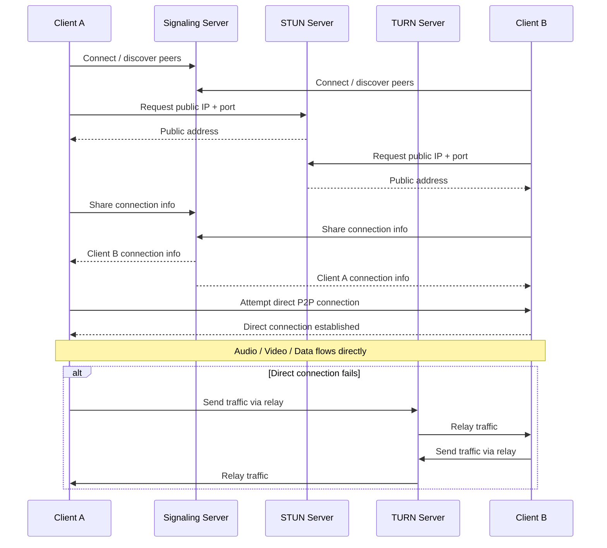

# Audio/Video Streaming  :: webRTC
## References
- https://www.hellointerview.com/learn/system-design/patterns/realtime-updates#long-polling-the-easy-solution 
- https://youtu.be/Kn_3uHaKz7Q?si=4RO9_-fleOyvILBt | bm webRTC

> ⚠️ WebRTC is an absolute pain to get right and even the best implementations still suffer connection losses. It truly is a niche solution.

## Overview
- enables **real-time peer-to-peer audio, video, and data** directly between browsers/apps.
-  If you have a system where clients need to talk to each other frequently, you could use WebRTC **to reduce the load on your servers** by having clients establish their own connections.

Key points:
* Usually **peer-to-peer**
* Supports **audio, video, and arbitrary data**
* Uses **UDP when possible** for low latency
* Uses **ICE, STUN, and TURN** to establish connections through NAT/firewalls
* Provides **encryption by default**
* More complex to set up than SSE or WebSockets

Key distinction:
- STUN → helps peers connect directly
- TURN → relays traffic when direct connection fails

## Complex setup

---
## when to use
- video calls, voice calls,
- screen sharing, 
- and P2P file/data transfer.

---

