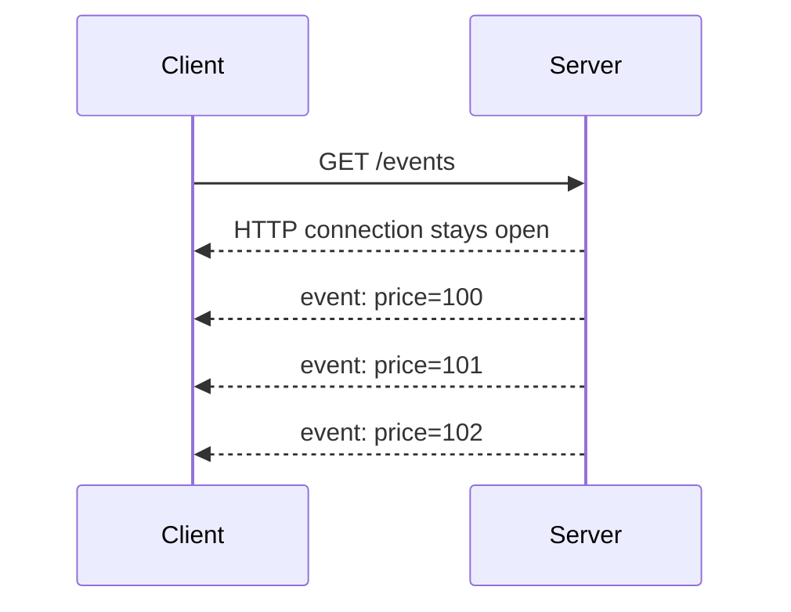
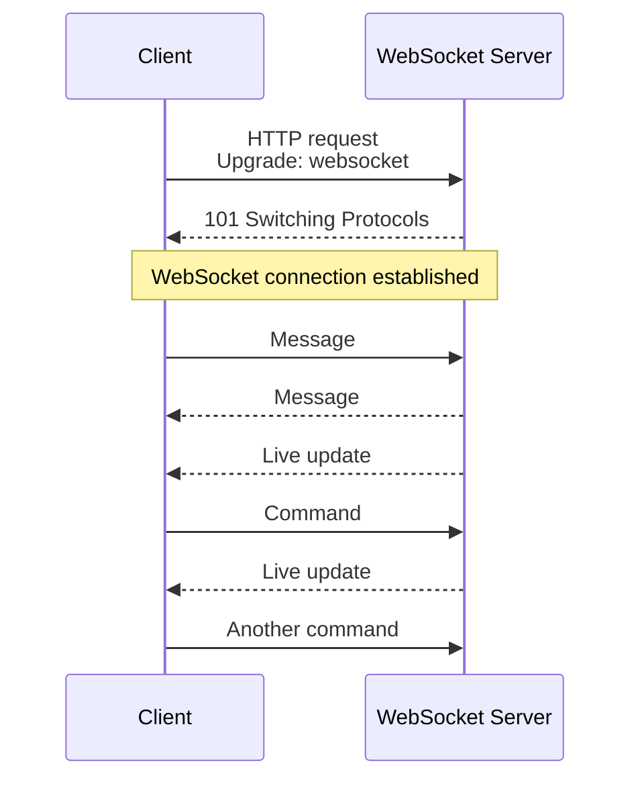
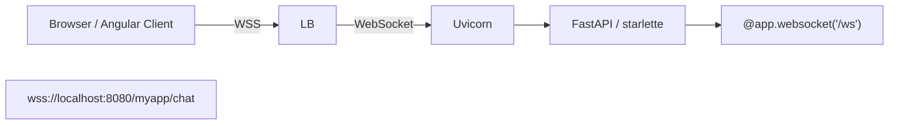

# Streaming (Http based) 

## Reference:
- [socket](../06_network/01_concept_01_socket.md)
- https://www.youtube.com/watch?v=pnj3Jbho5Ck | bm ws part-1 overview (2024) 
- https://www.youtube.com/watch?v=G0_e02DdH7I | bm ws part-2 details(2024) 
- https://www.youtube.com/watch?v=BKonNa7XPdg | bm ws part-3 more deep arch (2026) 
- https://www.hellointerview.com/learn/system-design/patterns/realtime-updates#long-polling-the-easy-solution | check

---
## A. Server-to-client
### 1. SSE 🌐
> Server-Sent Events (SSE) is a spec defined on top of HTTP that allows a server to push many messages to the client over a single HTTP connection.
> 
> think of it : SSE is a nice hack on top of HTTP that allows a server to stream many messages, over time, in a single response from the server.

- designed for streaming **textual data** over HTTP
- server pushes data to the client over a single, long-lived HTTP connection through socket
- use case: situations where you want clients to get notifications or events as soon as they happen.



```
 ✔️HTTP APIs you'd get a single, cohesive JSON blob as a response from the server 
 that is processed once the whole thing has been received.
 
{
  "events": [
    { "id": 1, "timestamp": "2025-01-01T00:00:00Z", "description": "Event 1" },
    { "id": 2, "timestamp": "2025-01-01T00:00:01Z", "description": "Event 2" },
    ...
    { "id": 100, "timestamp": "2025-01-01T00:00:10Z", "description": "Event 100" }
  ]
}


✔️On the other hand, with SSE, the server can push many messages 
as "chunks" in a single response from the server:

data: {"id": 1, "timestamp": "2025-01-01T00:00:00Z", "description": "Event 1"}
data: {"id": 2, "timestamp": "2025-01-01T00:00:01Z", "description": "Event 2"}
...
data: {"id": 100, "timestamp": "2025-01-01T00:00:10Z", "description": "Event 100"}
```

**limitations**:
* **Text-based**: mainly UTF-8 text; binary data needs encoding.
* **Connection limits**: browsers may limit concurrent SSE connections, especially with HTTP/1.1. 👈
* * **Persistent connection required**: proxies/load balancers must be configured to avoid buffering or timeouts. 👈
* **Not ideal for very interactive apps**: WebSockets are usually better for chat, multiplayer games, etc.
* **No native support in some non-browser clients** compared with ordinary HTTP.

---
### 2 grpc client streaming __
-  gRPC does support streaming.
- it's not ideal for external APIs due to limited support (e.g. no browsers support gRPC today). 

---
## B. client-to-Server
### 1 grpc client streaming __
-  not ideal for external APIs due to limited support (e.g. no browsers support gRPC today).

---
## C. Bidirectional
### 1. grpc bidirectional streaming __
-  not ideal for external APIs due to limited support (e.g. no browsers support gRPC today).

---
### 2. WebSocket / WSS 🌐
```
Additional infa 💲💲

        Persistent/Stateful connection:
Client  ◄══════════════════════► Server 
          send / receive
          send / receive
          send / receive
          
```

overview 1
- the client opening a **long-lived connection** with the server, typically through a **socket** 👈
- allowing the server to **push** information **without a client request** and vice versa. 

overview 2
- WebSockets provide a persistent, TCP-style connection between client and server, 
- allowing for real-time, bidirectional communication with broad support (including browsers). 
- Unlike HTTP's request-response model, WebSockets enable servers to push data to clients without being prompted by a new request. 
- Similarly clients can push data back to the server without the same wait.
- WebSockets are initiated via an HTTP "upgrade" protocol, which allows an existing TCP connection to change L7 protocols.
- This is super convenient because it means you can utilize some of the existing HTTP session information (e.g. cookies, headers, etc.) to your advantage.

> ⚠️ Just because clients can upgrade from HTTP to WebSocket doesn't mean that the infrastructure will support it. 
> Every piece of infrastructure between the client and server will need to support WebSocket connections.
> If you've ever implemented Websockets you've probably hit a bunch of issues with **firewalls, proxies, load balancers, 
> and other infrastructure** that don't support WebSocket connections.
> 
> ---
> WebSockets are powerful, but the infra required to support them can be expensive
> and the overhead of **stateful connections** (especially at scale) will require significant accommodations in your design. 
> Hold off unless you really need them!

#### use cases
> when you need high-frequency, persistent, bi-directional communication between client and server.
- Stock trading websites displaying live price fluctuations 
- Chat applications
- Gaming applications that require automatic UI refreshes

#### connection
```
- Https/TCP handshake
- negotiate to upgrade, to WS with request header:
    - `Upgrade: websocket`,
    - `Connection: Upgrade`,
    - `Sec-WebSocket-Key: xxxxxxxx`
- server validates:
    - response code `101` / Switching L7 Protocols,
    - response header:
        - `Sec-WebSocket-Accept: zzzzzzzzz`,
        - which is generated by concatenating the client's key with a GUID
        - and applying SHA-1 hashing.
- establishes a persistent, **bi-directional connection**/ tunnel
- both client/server, can stream **data-frame**, uninterrupted 👈🏻
- either, initiate close connection
```






#### Dataframe


| Field              | Purpose                                                       |
| ------------------ | ------------------------------------------------------------- |
| **FIN**            | `1` = Final frame of the message, `0` = More fragments follow |
| **RSV (3 bits)**   | Reserved for extensions (normally `0`)                        |
| **Opcode**         | Type of frame (Text, Binary, Ping, Pong, Close, etc.)         |
| **Mask Bit**       | `1` if payload is masked (required for client → server)       |
| **Payload Length** | Size of the payload (7, 16, or 64-bit length)                 |
| **Masking Key**    | 4-byte key used to unmask client payload                      |
| **Payload Data**   | Actual application data                                       |

Fragmentation:
- splitting large messages into smaller chunks to prevent buffer overflow
- and allow for gradual delivery of data.
- The FIN bit is used to indicate whether a fragment is the final part of a message.

#### Interview Takeaways
- WebSocket communicates using frames, not HTTP requests.
- Each frame contains a header + payload.
- FIN indicates whether more fragments follow.
- Opcode identifies the frame type (text, binary, ping, pong, close).
- Client → Server frames are masked; 
- Server → Client frames are not masked.
- Ping/Pong maintains long-lived connections and detects disconnects.


