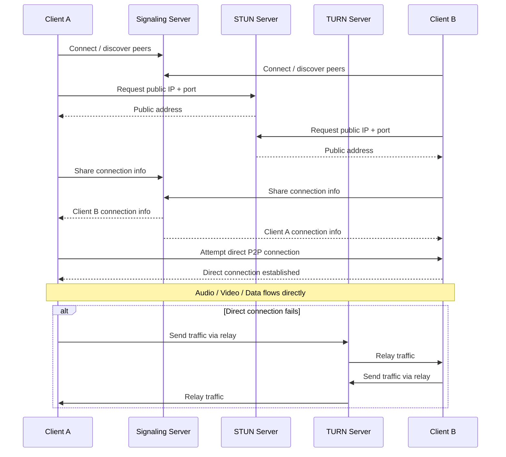

# Advance
## 1. Videos Streaming / ABS
- https://www.youtube.com/watch?v=kCAXpAikMVc
- ABS **Adaptive Bitrate Streaming**
    - adjusts video quality based on the viewer's internet
    - ABS works by encoding video at **multiple bitrates**
- Types of Video Streaming
    - Live streaming:
    - On-demand streaming
    - Peer-to-peer streaming: Distributing content where viewers share their bandwidth and computing resources

### DASH - Dynamic Adaptive Streaming over HTTP

### HLS - HTTP Live Streaming

### RTMP - realTime messaging Prot

---
## 2. WebRTC
- https://youtu.be/Kn_3uHaKz7Q?si=4RO9_-fleOyvILBt | watched once.

### Overview
- enables **real-time peer-to-peer audio, video, and data** directly between browsers/apps.
- Common uses: video calls, voice calls, screen sharing, and P2P file/data transfer.

Key points:
* Usually **peer-to-peer**
* Supports **audio, video, and arbitrary data**
* Uses **UDP when possible** for low latency
* Uses **ICE, STUN, and TURN** to establish connections through NAT/firewalls
* Provides **encryption by default**
* More complex to set up than SSE or WebSockets

Key distinction:
- STUN → helps peers connect directly
- TURN → relays traffic when direct connection fails

> ⚠️ WebRTC is an absolute pain to get right and even the best implementations still suffer connection losses. It truly is a niche solution.
