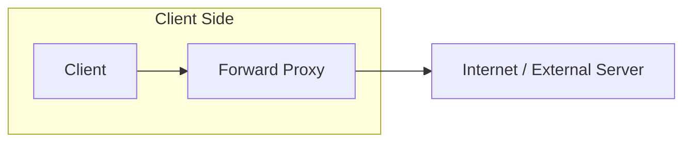
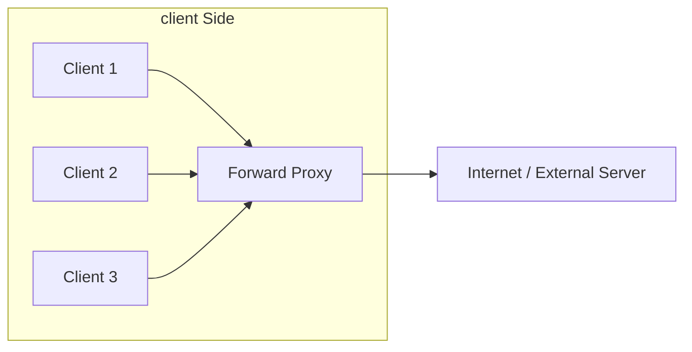
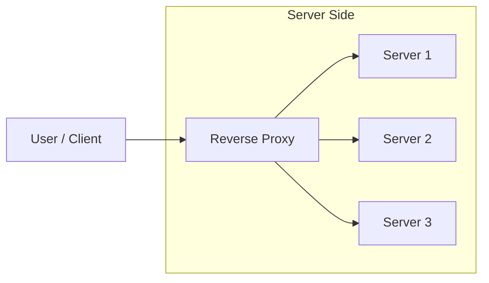

# Core building: Forward/reverse Proxy
- https://www.youtube.com/watch?v=qbuMKSTv3yU
- https://academy.bytemonk.io/products/system-design-mastery-beta/categories/2158360644/posts/2190592400
---
## Overview
| Aspect                 | Forward Proxy                | Reverse Proxy                       |
| ---------------------- | ---------------------------- |-------------------------------------|
| Hides                  | Client identity              | Server identity                     |
| Used by                | Users or internal networks   | Applications and platforms          |
| Examples               | Corporate proxy, VPN gateway | NGINX, Controlpanel in k8s, AWS ALB |

---
## Forward Proxy

**Common uses**
- bypass firewall restrictions 
- conceal their identity, as the origin server only sees the forward proxy's IP address (1:24-1:31). 

---
## Reverse Proxy

**Common uses**
- Load balancing
- TLS termination
- Authentication
- Rate limiting
- Caching (css, html, etc)
- Hiding backend servers
- Routing requests to microservices
