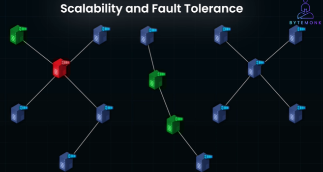
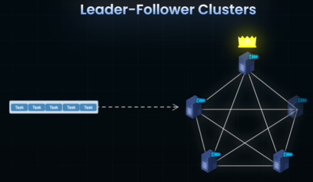
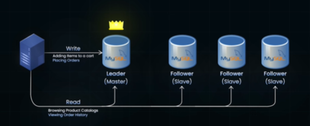
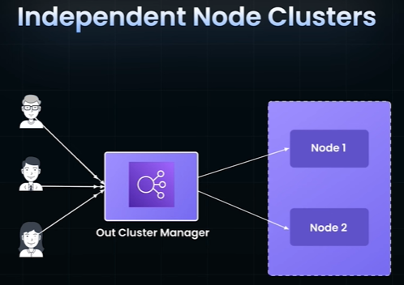

# Distributed System
> - Design Distributed System (large-Scale system)
> - Power can be augmented on the fly

## Overview
- independent computers (nodes) that appear to the users as a **single coherent system**.
- system runs on **multiple nodes** in same datacenter or geographically distributed.
- Nodes **communicate** over a network: 👈🏻
    - to achieve a common goal.
    - Coordination/collaborate there actions
    - maintain a shared state
    - Coordination can be direct
    - or via services like ZooKeeper, etcd, or consensus protocols (Raft, Paxos)
- Will discover best practice, algo, architecture to built DS. 👈🏻

```
Scenario-1
  - multiple os process running on same laptop (limited CPU,etc) to achieve common goal.
  - run these os process on diff laptop, connected on same network. little better.
  - take this further ahead brings the concept of DS.
```
## Examples (2)
- **microservices** 
  - popular way to build DS 
- **Simple app running on Cloud** is also DS, 
  - since cloud infra Distributed with region/s, az. 
  - And may auto-scale if user base grows

---    
## key concept: Network Partition👈🏻
- This occurs when a network failure (temporary and permanent)
- divides a distributed system into isolated parts,
- preventing communication between them.
- This is an **unavoidable fact** in distributed systems
- Single Node server, has No n/w Partition :)

---
## Clusters
- https://www.youtube.com/watch?v=pjWhtRtaJiA
- groups of interconnected servers or nodes that work together to handle large volumes of data and traffic by sharing workloads.
- essential for **scalability and fault tolerance**
- 

### Leader-Follower Clusters

- one node is designated as the **leader** and handles most coordination tasks,
- while others act as **followers** and carry out tasks assigned by the leader

**Example** mySQL
- leader database handles all write operations, 
- ensuring a single authoritative data source, 
- while follower databases handle read operations, balancing the load. 
- thus, maintaining consistency and high availability for billions of users.
- If the leader fails: 
  - a follower is promoted, ensuring minimal disruption
  - [Leader Election](../SD_06_Distributed-system/01_concept_01_consensus.md)



---
### Independent Node Clusters

- each node in this cluster functions independently to handle requests
- decentralized manner
- Requests are routed based on availability or proximity, typically managed by an **out-cluster manager** like a `load balancer`

**Example-1** - microservice myApp running in k8s cluster

**Example-2** - CDN cluster

**Example-3** - kafka
- Kafka uses multiple brokers (independent nodes)
- with each broker responsible for assigned data partitions
- and handle streaming data, independently

> note: Data is replicated **across brokers** for fault tolerance + an internal consensus mechanism (KRaft protocol) manages cluster metadata and coordination b/w read and in-sync replica

**Managers**

💠**In-cluster managers**
- operate within a single cluster,
- like Kubernetes or Kafka's KRaft protocol, 
- managing internal tasks such as leader election and partition assignment.

💠**Out-cluster managers** (7:47) 
- operate across multiple clusters 
- focusing on mapping tasks or clients to the appropriate cluster 
- A typical example is a load balancer in a multi-cluster setup.