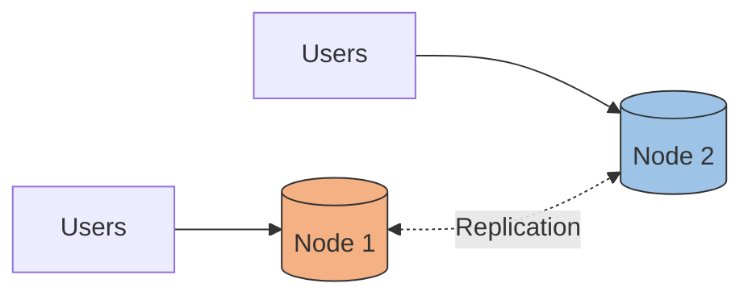
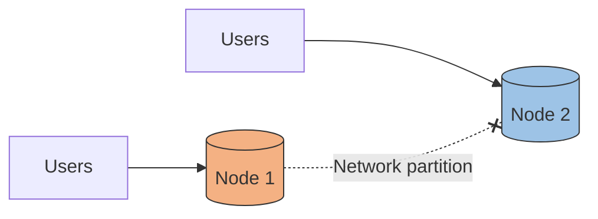
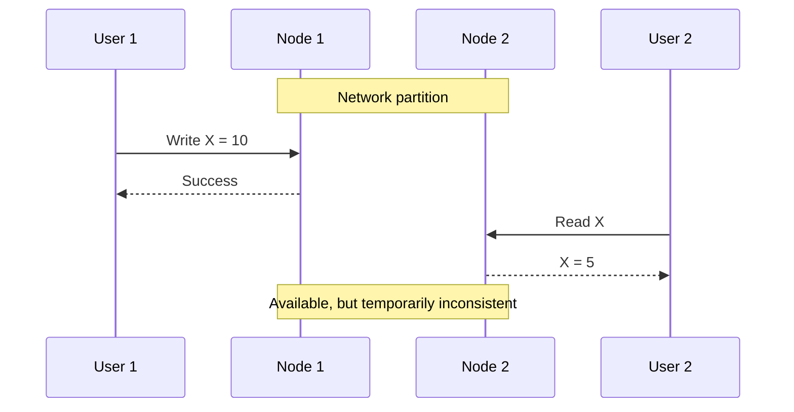
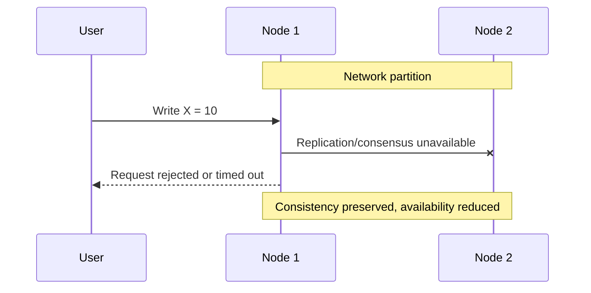
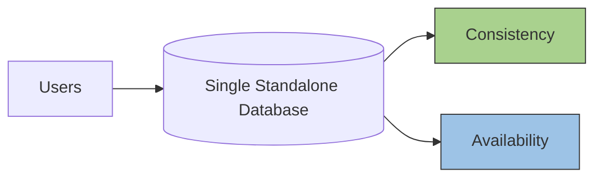

# CAP theorem
- https://academy.bytemonk.io/products/system-design-mastery-beta/categories/2158360645/posts/2190592662

> A distributed system can only guarantee two of the three properties: 
**Consistency**, **Availability**, and **Partition tolerance**.
> 
> CAP is NOT: “Pick two and ignore the third”
> 
> CAP IS: “When partition happens, you must choose between C and A”
>
> 👉👉A **network partition** is not an anomaly that stops a distributed system from being distributed; 
rather, it's a common and expected challenge that distributed systems are designed to handle, 
by choosing how they will prioritize **consistency** or **availability** during such an event.

---
## Concept overview
✔️Partition Tolerance (P)
- Ability to continue operating despite network failure
- in reality all DS continue to work, even if network fails (**between nodes**)
- so P is always there.

✔️Consistency (C) 
- Ensures that all nodes in a distributed system have the same, most up-to-date data. 
- If there's a partition, the system will not allow any actions until the network is restored, 
- guaranteeing 100% accurate data.
- levels of consistency: Strong, eventual

✔️Availability (A) 
- Ensures that the system remains operational and responsive even if some data is inconsistent or stale.
- The system will accept actions and process them later once the network is restored, 
- providing "eventual consistency."

## CAP Model (2) - CP or AP
```
- P Partition tolerance is "mandatory"
- we're really choosing between:
  - CP → correctness first
  - AP → uptime first
- CA is a fantasy outside of single-node systems
```

## Understand by scenario
### regular day

### partition occurred

**next choose Ap vs CP as per system NFR**

### Choose: AP system (DB) 
[02_NFR_01_Availability.md](../SD_02_Non-functional-req/02_NFR_01_Availability.md)

### Choose: CP system (DB)
[02_NFR_04_consistency.md](../SD_02_Non-functional-req/02_NFR_04_consistency.md)

### CA system (DB)
- eg: sql database running on **single powerful machine**.
- hence no need to deal with partition and are `CA system`.
- but is SPF
- hence can say is not **practical resilient architecture** util backend by : 
  - read replica or standby, 
  - failover, promote read replica, 
  - etc. 
  - hence network partition is back again :)
  

---
## Real world scenarios
| System | Consistency | Availability  |  
| ---| ---|---| 
| **Kafka** | ✅  |               |
| **Aurora Global** | | ✅             | 
| **DynamoDB**    | | ✅             |


