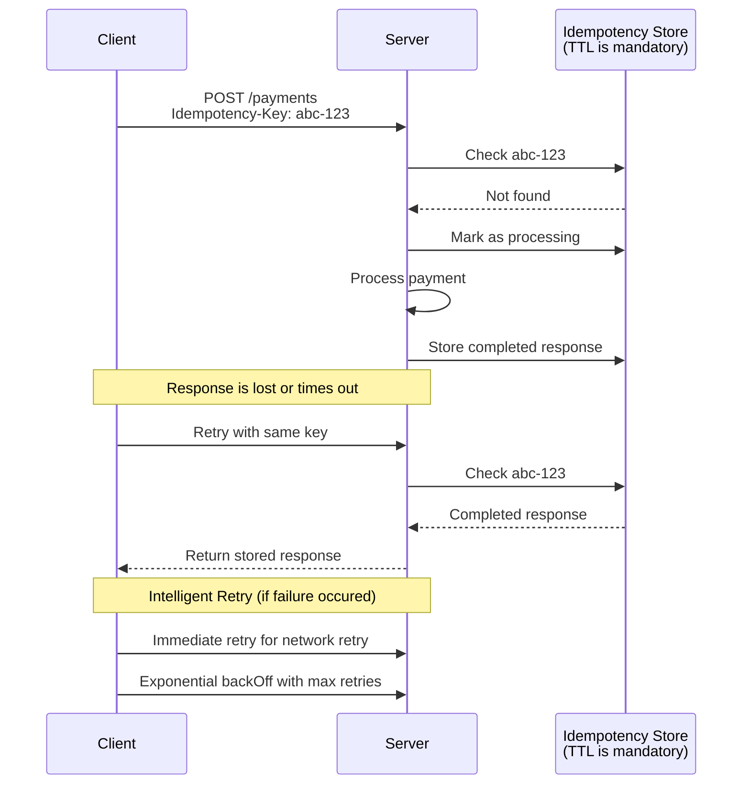
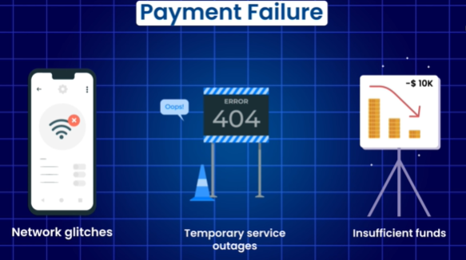

# Idempotency (Skip)
- https://academy.bytemonk.io/products/system-design-mastery-beta/categories/2158360644/posts/2192055909
- https://www.youtube.com/watch?v=S3nq_Iq4eMI

## Overview
- Idempotency ensures that an operation can be performed multiple times without changing the outcome 
- create and store Idempotency-Key: 8f6b1d4e-...
- TTL is mandatory, don’t keep keys forever.

## Handshake between retries & idempotency

---
## PayPal Example
**PayPal implementation to avoid duplicate payment**
- `idempotency keys` extensively to prevent duplicate payments
- http header: `PayPal-Request-Id`
- it first checks an in-memory cache (like Redis) and then persistent storage (like a relational database) for the key.
- If found, the stored result is returned.

## Strip example

